# Architecture — Deus Ex: Neon Merlion

Deus Ex: Neon Merlion is a 3D cyberpunk exploration game built on **Babylon.js 7.52.2** (no game framework, no physics engine). Its differentiator is a **dual-LLM pipeline**: one model streams creative NPC dialogue while a second, colder model evaluates the conversation to decide — with a single `yes`/`no` — whether a quest condition has been met. Levels, NPCs, rendering, and UI are wired together through a small set of `window` globals and a custom-event bus, so most subsystems never import each other directly.

This document is the canonical reference for how the system fits together. It is organized as **structured bullets + tables** alongside **visual diagrams**. Every diagram appears in **both Mermaid and ASCII** so it renders on GitHub and stays legible in a plain terminal.

---

## Table of Contents

1. [Overview & Entry Flow](#1--overview--entry-flow)
   - 1.1 [System Map](#11-system-map)
   - [1.2 Entry Chain](#12-entry-chain)
   - [1.3 `createScene(levelType)` internals](#13-createsceneleveltype-internals)
   - [1.4 `recreateScene(levelType)`](#14-recreatesceneleveltype)
   - [1.5 Global State Registry](#15-global-state-registry)
   - [1.6 Custom Event Catalog](#16-custom-event-catalog)
   - [1.7 Tech Stack](#17-tech-stack)
   - Diagrams: [D1 High-Level System](#diagram-1-high-level-system-architecture), [D2 Startup Sequence](#diagram-2-startup-sequence-flow), [D3 Scene Lifecycle](#diagram-3-scene-lifecycle)
2. [LLM Dialogue & Quest System](#2--llm-dialogue--quest-system)
   - 2.1 [Dual-LLM Architecture](#21-dual-llm-architecture)
   - 2.2 [Model Configuration Matrix](#22-model-configuration-matrix)
   - 2.3 [Prompt Construction Branch Logic](#23-prompt-construction-branch-logic)
   - 2.4 [Dialogue Data Flow](#24-dialogue-data-flow-step-by-step)
   - 2.5 [Quest Condition Evaluation Flow](#25-quest-condition-evaluation-flow)
   - 2.6 [Condition Schema](#26-condition-schema)
   - 2.7 [Singapore6 Worked Example](#27-singapore6-worked-example)
   - 2.8 [Error Handling](#28-error-handling)
   - Diagrams: [D4 Dual-LLM](#diagram-4-dual-llm-architecture-overview), [D5 Dialogue Round-Trip](#diagram-5-full-dialogue-round-trip-sequence), [D6 Prompt Branch](#diagram-6-prompt-construction-branch-logic), [D7 Condition Lifecycle](#diagram-7-quest-condition-lifecycle)
3. [Level System](#3--level-system)
   - 3.1 [Class Hierarchy](#31-class-hierarchy)
   - 3.2 [Level Folder Composition](#32-level-folder-composition)
   - 3.3 [Level Factory](#33-level-factory)
   - 3.4 [Level Progression](#34-level-progression)
   - 3.5 [Known Issues / Naming Collision](#35-known-issues--naming-collision)
   - Diagrams: [D8 Class Hierarchy](#diagram-8-level-class-hierarchy), [D9 Folder Composition](#diagram-9-level-folder-composition), [D10 Progression FSM](#diagram-10-level-progression-state-machine)
4. [NPC System](#4--npc-system)
   - 4.1 [Persona Data Schema](#41-persona-data-schema)
   - 4.2 [NPC Roster](#42-npc-roster)
   - 4.3 [NPCBase Class](#43-npcbase-class)
   - 4.4 [Movement State Machine](#44-movement-state-machine)
   - 4.5 [Interaction Flow](#45-interaction-flow)
   - 4.6 [Subclass Pattern](#46-subclass-pattern)
   - Diagrams: [D11 Movement FSM](#diagram-11-npc-movement-state-machine), [D12 Interaction Sequence](#diagram-12-npc-interaction-sequence)
5. [Rendering Pipeline](#5--rendering-pipeline-components-effects-lighting)
   - 5.1 [Component System](#51-component-system)
   - 5.2 [MaterialFactory](#52-materialfactory)
   - 5.3 [Component Lifecycle](#53-component-lifecycle)
   - 5.4 [Visual Effects](#54-visual-effects)
   - 5.5 [Light Clustering (key optimization)](#55-light-clustering-key-optimization)
   - 5.6 [Camera](#56-camera)
   - 5.7 [Player Character](#57-player-character)
   - Diagrams: [D13 Component Hierarchy](#diagram-13-component-class-hierarchy), [D14 Light Pipeline](#diagram-14-light-clustering-optimization-pipeline), [D15 Effect Loop](#diagram-15-effect-manager-update-loop)
6. [UI Layer & Event System](#6--ui-layer--event-system)
   - 6.1 [UI Inventory](#61-ui-inventory)
   - 6.2 [Input Mapping](#62-input-mapping)
   - 6.3 [User Settings Flow](#63-user-settings-flow)
   - 6.4 [Event-Driven Architecture](#64-event-driven-architecture)
   - 6.5 [Collision Detection](#65-collision-detection)
   - Diagrams: [D16 Event Bus](#diagram-16-event-bus-topology), [D17 UI Map](#diagram-17-ui-component-interaction-map)

---

## Conventions & Legend

- **Dual diagram format.** Every diagram is rendered twice: a [Mermaid](https://mermaid.js.org/) block (renders on GitHub) and an ASCII-art block (legible in any terminal/diff). The two are semantically identical.
- **File references** use repo-root-relative paths with line numbers, e.g. `main.ts:115` means file `main.ts` at line 115. There is **no `src/` directory** in this repo — code lives at the root under `levels/`, `quest/`, `ui/`, `characters/`, `components/`, `fx/`, `config/`, with `index.ts`, `main.ts`, and `camera.js` at the top level.
- **Globals** are written as `window.<name>`. See [§1.5](#15-global-state-registry) for the registry.
- **Events** are written in backtick-code form: `` `conditionCompleted` ``. See [§1.6](#16-custom-event-catalog) and [§6.4](#64-event-driven-architecture).
- Cross-links to the root `README.md` and `docs/scope.md` are noted where relevant. The README does not currently link into `docs/`.

---

# 1 — Overview & Entry Flow

## 1.1 System Map

Seven subsystems plus one external dependency:

| # | Subsystem | Responsibility | Key files |
|---|---|---|---|
| 1 | **Entry & Loop** | Boots engine, owns render loop, swaps scenes | `index.ts`, `main.ts` |
| 2 | **Levels** | Build geometry, lighting, populate NPCs, register quests | `levels/levelGenerator.js`, `levels/<name>/` |
| 3 | **NPCs** | Persona data + movement FSM + interaction trigger | `characters/gameplay/NPCBase.js`, `characters/data/*.js` |
| 4 | **Dialogue & Quests** | LLM streaming + LLM evaluation of conditions | `quest/chatService.js`, `quest/ResolutionManager.js`, `quest/DialogueManager.js` |
| 5 | **Rendering** | Components, materials, effects, light clustering, camera | `components/`, `fx/`, `camera.js` |
| 6 | **UI** | DOM overlays: chat, journal, settings, menus, debug | `ui/chatUI.js`, `ui/controls.js`, `ui/debugControls.js`, `quest/settingsUI.js`, `quest/questJournal.js` |
| 7 | **Progression & Audio** | Level ordering, scene swaps, music transitions | `quest/levelProgression.js`, `config/levelOrder.js`, `quest/MusicManager.js` |
| E | **OpenRouter** (external) | LLM inference gateway over HTTPS + SSE | `https://openrouter.ai/api/v1` |

## 1.2 Entry Chain

- `index.html` defines the `<canvas id="renderCanvas">` and loads the bundled `index.ts`.
- **`index.ts:16-18`** exposes the Babylon modules as globals: `window.BABYLON`, `window.BABYLON.GUI`, `window.BABYLON.Materials`. Many `.js` files rely on this global instead of ESM imports.
- **`index.ts:23-26`** dynamically imports `ui/chatUI.js` and constructs `new ChatUI()` (which sets `window.chatUI` at `ui/chatUI.js:15`).
- **`index.ts:29-30`** dynamically imports `main.ts` and calls `initGame()`.
- **`index.ts:38-43`** standalone-mode fallback: if `#app` is absent, `initGame()` runs on `DOMContentLoaded`.
- **`main.ts:115`** `initGame()` is the real bootstrap:
  - `main.ts:117-122` grab canvas, create `BABYLON.Engine`.
  - `main.ts:123` create `DebugUI`.
  - `main.ts:126-132` create `DebugControls` with a level-switch callback (disposes current scene, builds a new one).
  - `main.ts:135` `initializeFPSDisplay(engine)`.
  - `main.ts:138` `createScene()` (default level `singapore6`).
  - `main.ts:141-145` `engine.runRenderLoop(() => currentScene.render())`.
  - `main.ts:148-150` resize handler.
  - `main.ts:153-160` parallel dynamic imports construct `MusicManager` and `LevelProgression` (which sets `window.levelProgression` at `main.ts:158`).
- **`main.ts:171`** assigns `recreateScene` to `window.recreateScene`.

## 1.3 `createScene(levelType)` internals

Defined at **`main.ts:23-113`**:

- `main.ts:25` `new BABYLON.Scene(engine)`.
- `main.ts:28` `new GameCamera(canvas, scene)` (see [§5.6](#56-camera)).
- `main.ts:29` `debugControls.getLevelGenerator(levelType, scene)` — the factory at `ui/debugControls.js:84-103` (see [§3.3](#33-level-factory)).
- `main.ts:32` `await levelGenerator.createLevel()` — returns `{ground, walls, cellSize, bounds}`; sets `window.currentLevel` inside the base constructor at `levels/levelGenerator.js:58`.
- `main.ts:33-41` `await loadCharacters(scene)` from `characters/pc/maincharacter.js` — imports 7 GLB meshes (see [§5.7](#57-player-character)).
- `main.ts:44-48` `scene.onPointerDown` requests pointer lock.
- `main.ts:51-60` `scene.onPointerMove` rotates the camera by `evt.movementX/Y * 0.002`.
- `main.ts:63` `getSpawnPosition(levelType)`.
- `main.ts:76-81` reposition all 7 character meshes to the spawn.
- `main.ts:84-94` `new Controls(scene, idle, fwd, back, left, right, run, dance, gameCamera)`.
- `main.ts:96-97` `gameCamera.setCharacter(currentCharacter)`.
- `main.ts:100-102` `scene.registerBeforeRender(() => debugUI.update(currentCharacter))`.
- `main.ts:105-106` `scene.materialsNeedSceneLighting = true`; sky-blue `clearColor`.

## 1.4 `recreateScene(levelType)`

- Defined at **`main.ts:163-168`**: disposes `currentScene` if present, then `await createScene(levelType)`.
- Exported and assigned to `window.recreateScene` at `main.ts:171`.
- Consumed by `LevelProgression.handleLevelChange` (`quest/levelProgression.js:49`) and by the `DebugControls` level-switch callback at `main.ts:126-132`.

## 1.5 Global State Registry

The game leans on `window.*` for cross-module communication. Most subsystems read globals rather than receiving dependencies via constructors.

| Global | Set by | Read by |
|---|---|---|
| `window.BABYLON` / `.GUI` / `.Materials` | `index.ts:16-18` | virtually every `.js` file |
| `window.chatUI` | `ui/chatUI.js:15`; also `characters/gameplay/NPCBase.js:166` as a fallback re-init | `quest/DialogueManager.js`, `ui/controls.js` |
| `window.currentLevel` | base constructor `levels/levelGenerator.js:58` (and redundantly in each subclass constructor) | `quest/ResolutionManager.js`, `ui/controls.js` |
| `window.levelProgression` | `main.ts:158` | `ui/controls.js` ('P' key), `quest/mainMenu.js`, `ui/creditsUI.js` |
| `window.resolutionManager` | per-level `quest.js` (e.g. `levels/singapore6/quest.js:7`) | `quest/chatService.js:69-74` (the 1s delayed evaluation trigger) |
| `window.recreateScene` | `main.ts:171` | `quest/levelProgression.js:49`, `main.ts:128` |
| `window.gameCamera` | `camera.js` constructor (sets itself) | `ui/chatUI.js:334`, `fx/lighting/ClusterManager.js` |
| `window.userSettings` | `quest/userSettings.js:32` | `quest/settingsUI.js`, `quest/chatService.js`, `quest/ResolutionManager.js` |
| `window.debugUI` | `ui/debugUI.js` constructor | `quest/chatService.js:245-251` (error display) |
| `window.currentLevelType` | `main.ts` (module-level) | level factory plumbing |

## 1.6 Custom Event Catalog

All events use `window.dispatchEvent(new CustomEvent(name, { detail }))` and `window.addEventListener(name, handler)`. They are the primary decoupling mechanism — see [§6.4](#64-event-driven-architecture) for the full topology.

| Event | Dispatcher | Listener(s) | Payload | Purpose |
|---|---|---|---|---|
| `changeLevel` | `quest/levelProgression.js:63`, `quest/mainMenu.js:36` | `quest/levelProgression.js:12`, `quest/MusicManager.js:16` | `{ levelId: string }` | Drive scene swap + music transition |
| `conditionCompleted` | `quest/ResolutionManager.js:196` | `levels/singapore6/quest.js:26`, `levels/taiyong/taiyongLevel.js:406` | `{ conditionId, levelId }` | Notify level-specific handlers (path resolution, door state) |
| `levelExitUnlocked` | `quest/ResolutionManager.js:234` | `levels/singapore6/quest.js:18`, `levels/nightclub/quest.js:18`, `levels/taiyong/quest.js:18`, `levels/nightclub/nightClubLevel.js:74` | `{ levelId }` | Surface the "exit now open" notification |
| `lockPlayerControls` | `ui/chatUI.js:339/381`, `quest/questJournal.js:168/182`, `quest/settingsUI.js:291/306`, `quest/DialogueManager.js:87`, `characters/gameplay/NPCBase.js:176` | `ui/controls.js:30` | `boolean` | Freeze/unfreeze WASD during modal UIs |
| `stopCharacterMovement` | `ui/chatUI.js:343`, `quest/questJournal.js:172`, `quest/settingsUI.js:295` | `ui/controls.js:34` | — | Snap the character to idle immediately |
| `modelChanged` | `quest/userSettings.js:80` | `quest/chatService.js:12`, `quest/ResolutionManager.js:18` | `{ modelId }` | Hot-swap the runtime LLM everywhere |
| `toggleDebugOverlay` | `ui/debugControls.js:80` | `ui/debugUI.js:57` | — | '1' key toggles FPS/position overlay |
| `globalPointsUpdated` | `quest/ResolutionManager.js:356` | **none — orphaned** | `{ globalPoints }` | Dispatched but currently has no consumer |
| `npcInteraction` | **none — orphaned** | `levels/singapore6/quest.js:13`, `levels/nightclub/quest.js:13`, `levels/taiyong/quest.js:13` | `{ npcId }` (intended) | Listened for but never dispatched; dead listener code |
| `startGame` | `ui/mainMenuUI.js:68` | `quest/mainMenu.js:15` | — | Main menu → first level |

## 1.7 Tech Stack

- **Babylon.js 7.52.2** — `@babylonjs/core`, `@babylonjs/gui`, `@babylonjs/loaders`, `@babylonjs/materials` (all pinned `^7.52.2`).
- **Build** — Webpack 5 (`^5.0.0`), `webpack-cli 4`, `webpack-dev-server 4`, `ts-loader 9`, `typescript 5.3`, `html-webpack-plugin 5`, `copy-webpack-plugin 11`.
- **Styling** — TailwindCSS `3.4.17`, PostCSS `8.5.3`, `autoprefixer 10.4.21`, `postcss-loader 7`, `css-loader 6`, `style-loader 3`.
- **LLM transport** — raw `fetch` against `https://openrouter.ai/api/v1/chat/completions`, streaming responses decoded via `ReadableStream` + `TextDecoder` + manual SSE line parsing (no SDK).
- **No** game framework, **no** physics engine, **no** state management library. Collision is ray-based (see [§6.5](#65-collision-detection)); state is the event bus + `window` globals.

---

### Diagram 1: High-Level System Architecture

**Mermaid:**
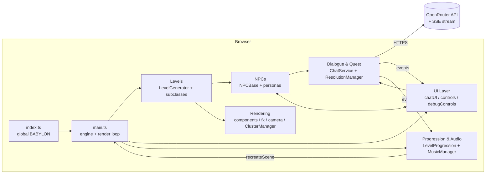

**ASCII:**
```
+-----------------------------------------------------------------------+
|                              Browser                                  |
|                                                                       |
|  index.ts  --->  main.ts (engine + runRenderLoop)                     |
|                   |          ^                                        |
|                   v          | recreateScene                          |
|                 Levels  ---> Progression & Audio                      |
|                   |                 ^                                 |
|        +----------+----------+      | changeLevel                     |
|        v                     v     |                                  |
|     NPCs <--- UI Layer       ResolutionManager --HTTPS--> OpenRouter  |
|        |        ^   |         ^        |              (SSE stream)    |
|        |        |   |         |        yes/no                          |
|        v        |   v         |                                        |
|   Rendering <---+ Dialogue ---+                                        |
|   (components,   Manager                                              |
|    fx, camera,                                                        |
|    ClusterManager)                                                    |
+-----------------------------------------------------------------------+
```

---

### Diagram 2: Startup Sequence Flow

**Mermaid:**
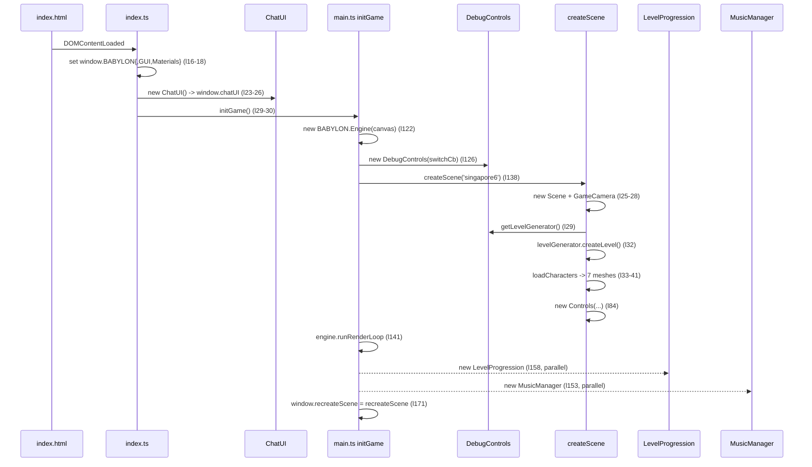

**ASCII:**
```
DOM ready
  |
  v
index.ts:16-18      set window.BABYLON / GUI / Materials
index.ts:23-26      new ChatUI()  -->  window.chatUI
index.ts:29-30      initGame()
  |
  v
main.ts:117-122     canvas + new BABYLON.Engine
main.ts:123-135     new DebugUI + new DebugControls(switchCb)
main.ts:138         createScene('singapore6')
  |                   |-- new Scene + new GameCamera            (l25-28)
  |                   |-- debugControls.getLevelGenerator       (l29)
  |                   |-- levelGenerator.createLevel()          (l32)
  |                   |     \__ window.currentLevel = this      (levelGenerator.js:58)
  |                   |-- loadCharacters() -> 7 GLBs            (l33-41)
  |                   |-- pointer lock + mouse look             (l44-60)
  |                   |-- spawn + reposition characters         (l63-81)
  |                   \-- new Controls(7 chars, camera)         (l84-94)
  |
  v
main.ts:141-145     engine.runRenderLoop(() => scene.render())
main.ts:153-160     Promise.all:  [ new MusicManager(),  new LevelProgression() ]
main.ts:171         window.recreateScene = recreateScene
```

---

### Diagram 3: Scene Lifecycle

**Mermaid:**
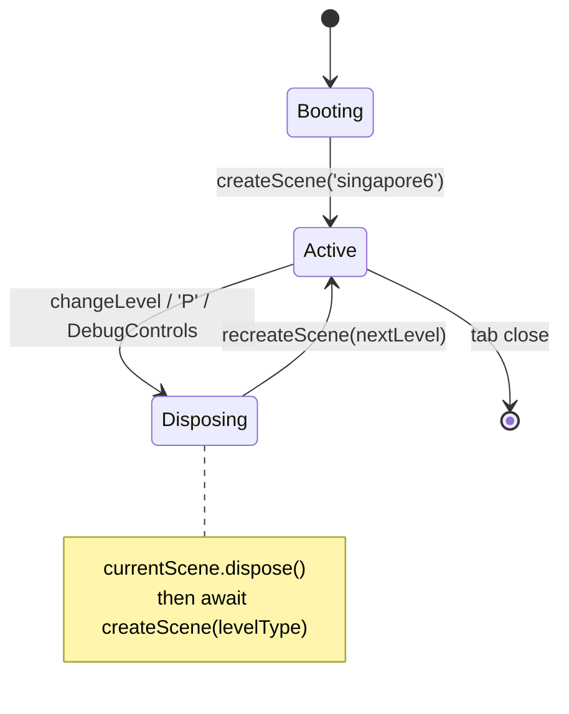

**ASCII:**
```
                    createScene('singapore6')
        [boot] -----------------------> [ACTIVE]
                                         |
                                         | trigger:
                                         |   - changeLevel event
                                         |   - 'P' key (gated)
                                         |   - DebugControls 'L' pick
                                         v
                                    [DISPOSING]
                       currentScene.dispose()
                                         |
                                         v
                       await createScene(nextLevel)
                                         |
                                         +-------------------> [ACTIVE]
                                         |                       (loop)
                                         v
                                    [tab closed]
```

---

# 2 — LLM Dialogue & Quest System

The core differentiator. Two LLMs collaborate on every conversation: a **Dialogue LLM** that streams the NPC reply, and a **Resolution LLM** that audits the transcript one second later to decide if a quest condition was satisfied.

## 2.1 Dual-LLM Architecture

- **Dialogue LLM** — streaming (`stream: true`), temperature 0.5-0.8, max_tokens 800-1200, history 4-8 turns. Creative voice for the NPC.
- **Resolution LLM** — non-streaming (`stream: false`), temperature 0.05-0.2, max_tokens 50-300. Returns a single `yes`/`no`.
- **Shared runtime model.** Both LLMs use `userSettings.currentModel` (see [§6.3](#63-user-settings-flow)). They pull *different* parameter profiles from `config/llm.js` for the same model id: dialogue config vs resolution config.
- **Decoupling delay.** After the dialogue LLM finishes, `chatService` schedules `resolutionManager.evaluateConversation(npcId, history)` via `setTimeout(..., 1000)` at `quest/chatService.js:71-74`. This delay lets the assistant message land in the UI before the audit runs, and avoids double-evaluating during rapid typing.

## 2.2 Model Configuration Matrix

`LLM_CONFIG.MODELS` in `config/llm.js:9-100`. Every model has both a `dialogue` and `resolution` profile.

| Model id (`config/models.js`) | `supports_system` | Dialogue `temp / max_tokens / max_history` | Resolution `temp / max_tokens` |
|---|---|---|---|
| `google/gemma-3-27b-it:free` (default) | `false` | 0.8 / 800 / 4 | 0.2 / 50 |
| `qwen/qwen3-14b-04-28:free` | `true` | 0.7 / 1000 / 6 | 0.1 / 100 |
| `openai/gpt-oss-20b:free` | `true` | 0.7 / 1200 / 8 | 0.05 / 150 |
| `deepseek/deepseek-chat-v3-0324:free` | `true` | 0.6 / 1000 / 6 | 0.1 / 200 |
| `deepseek/deepseek-r1-0528:free` | `true` | 0.5 / 800 / 5 | 0.05 / 300 |
| `deepseek/deepseek-r1:free` | `true` | 0.5 / 800 / 5 | 0.05 / 300 |
| **`DEFAULT`** (fallback, `llm.js:103-116`) | `true` | 0.7 / 1000 / 5 | 0.1 / 300 |

Shared settings (`LLM_CONFIG.SHARED`, `llm.js:171-180`): `retry_attempts: 3`, `retry_delay: 1000 ms`, `enable_logging: true`. All models set `dialogue.stream: true`, `resolution.stream: false`.

## 2.3 Prompt Construction Branch Logic

The dialogue path branches on whether the runtime model accepts a system message. The check is `supportsSystemMessages(currentModel)` defined at **`config/llm.js:192-195`** (returns `false` only if the model entry explicitly sets `supports_system: false`; defaults to `true`).

- **Branch A — system-capable models.** `chatService.js:161-180` calls `buildDialoguePrompt(npcName, persona, questDetails, model)` (`llm.js:198-206`) which returns `SYSTEM_DIALOGUE(npcName, persona, questInfo)` (`llm.js:121-122`). The system message carries the persona + quest context; the user turns are appended verbatim.
- **Branch B — non-system models (e.g. Gemma 3).** `chatService.js:161-165` calls `buildUserPromptWithContext(npcName, persona, questDetails, userMessage)` (`llm.js:208-211`) which returns `USER_WITH_CONTEXT(...)` (`llm.js:125-126`). Persona + quest context are embedded inside the single user message.
- **`QUEST_INFO` template** (`llm.js:129-140`) joins `questDetails.relevantInfo`, `questDetails.connections`, and `questDetails.playerObjectives` with newlines, and instructs the model to "stay in character", "keep responses brief (2-3 sentences)", and "DO NOT include any action text, asterisks, or descriptions of physical actions."
- **Resolution path uses `EVALUATION`** (`llm.js:143-154`): wraps `conversationContext` + the natural-language `condition`, and demands "EXACTLY ONE WORD, either `yes` or `no`". Built by `buildResolutionPrompt` at `llm.js:213-215`.

## 2.4 Dialogue Data Flow (step by step)

1. Player types in `ChatUI` and `handleSubmit()` runs (`ui/chatUI.js:427-456`): trims input, shows a cyan "thinking..." placeholder, rotates camera from player to NPC, then calls `streamResponse(question)` at `ui/chatUI.js:451`.
2. `streamResponse()` (`ui/chatUI.js:458-498`) calls `chatService.streamChat(content, npc, onChunk, onComplete, onError)`.
3. `ChatService.streamChat` (`quest/chatService.js:108-394`):
   - `l155` `addToHistory(npc, 'user', content)`.
   - `l157-195` build the `messages` array via the branch logic above.
   - `l200-206` assemble the request body using the per-model dialogue profile.
   - `l212` `POST` to `this.baseUrl` with the OpenRouter key.
   - `l224-254` map HTTP errors to messages (see [§2.8](#28-error-handling)).
   - `l256` `response.body.getReader()`.
   - `l268` `while (true) { reader.read(); ... }`.
   - `l281-283` split the decoded chunk on `\n`.
   - `l287-292` if line starts with `data: `, slice the prefix; if the payload is `[DONE]`, break.
   - `l295` `JSON.parse(data)`.
   - `l317` extract `choices[0].delta.content`.
   - `l319-325` call `onChunk(contentChunk)` — the UI appends to the visible bubble.
4. On stream end, `onComplete(fullResponse)` runs (`ui/chatUI.js:475-482`): it strips action text in asterisks via `/\*[^*]*\*/g`, replaces the bubble content with the filtered version.
5. `chatService` then `addToHistory(npc, 'assistant', fullResponse)` (`chatService.js` tail). Inside `addToHistory` (`chatService.js:55-76`):
   - `l57` push `{role:'assistant', content}`.
   - `l60-65` trim to `modelConfig.max_history_length` via `history.shift()`.
   - `l69` if `role === 'assistant' && history.length >= 2 && window.resolutionManager` →
   - `l71-74` `setTimeout(..., 1000)` → `window.resolutionManager.evaluateConversation(npcId, history)`.

## 2.5 Quest Condition Evaluation Flow

1. `ResolutionManager.evaluateConversation(npcId, conversationHistory)` (`quest/ResolutionManager.js:48-81`):
   - `l49` read `window.currentLevel.levelId`.
   - `l50` `getConditions(levelId)`.
   - `l53-57` filter: `condition.npcIds.includes(npcId) || condition.npcIds.includes('ANY')`, and `!completedConditions[condition.id]`.
   - `l67` `formatConversationForLLM(history)` via `CONVERSATION_FORMAT` (`llm.js:157-164`).
   - `l72` for each applicable condition, `await checkConditionWithLLM(condition, ctx)`.
   - `l76` on `true`, `completeCondition(levelId, condition)`.
2. `checkConditionWithLLM` (`ResolutionManager.js:93-181`):
   - `l96` `buildResolutionPrompt(ctx, condition.condition)`.
   - `l102` `getModelConfig(userSettings.currentModel, 'resolution')` — pulls the *resolution* profile.
   - `l104-113` POST **non-streaming** to `this.evaluationEndpoint`.
   - `l132` read full `response.text()`.
   - `l158` `answer = data.choices[0].message.content.trim().toLowerCase()`.
   - `l175` `return answer.includes('yes')`.
3. `completeCondition` (`ResolutionManager.js:183-209`):
   - `l185` `completedConditions[condition.id] = true`.
   - `l188` `levelPoints[levelId] += condition.points`.
   - `l193` `showNotification('Objective completed: ' + id)`.
   - `l196-202` dispatch `conditionCompleted { detail: { conditionId, levelId } }`.
   - `l205` `checkLevelCompletion(levelId)`.
   - `l208` save progress.
4. `checkLevelCompletion` (`ResolutionManager.js:211-227`):
   - `l216-218` `allRequiredMet` = every `required: true` condition for the level is in `completedConditions`.
   - `l223` level is complete iff `points >= threshold && allRequiredMet`.
   - `l225` then `unlockLevelExit(levelId)`.
5. `unlockLevelExit` (`ResolutionManager.js:229-239`):
   - `l234-235` dispatch `levelExitUnlocked { detail: { levelId } }`.
   - `l238` prominent 10-second notification "Exit is now accessible!".

## 2.6 Condition Schema

A condition is a plain object registered via `resolutionManager.registerLevel(levelId, conditions, threshold)`. Fields:

| Field | Type | Meaning |
|---|---|---|
| `id` | `string` | Unique key; used in `completedConditions` and in notifications (`id.replace(/_/g,' ')`) |
| `points` | `number` | Awarded to `levelPoints[levelId]` on completion |
| `condition` | `string` | Natural-language sentence the Resolution LLM judges |
| `npcIds` | `string[]` | Which NPCs' conversations can satisfy this (or `['ANY']`) |
| `required` | `boolean` | If `true`, must be met before the level exit unlocks (independent of points) |
| `pathId` | `string` (optional) | Groups conditions into branching paths |
| `resolvesLevel` | `boolean` (optional) | If `true`, completing this condition auto-completes the level regardless of threshold |

## 2.7 Singapore6 Worked Example

`levels/singapore6/quest.js`:

- **Threshold**: 10 points (`quest.js:187`).
- **Conditions**: 13 total (`quest.js:38-183`).
  - 2 global, `required: true` preamble conditions: `discovered_taiyong_recruitment` (l41), `found_way_inside_taiyong` (l50).
  - 11 path-specific conditions spread across 5 parallel paths.
- **Five branching paths**, each ending in a `resolvesLevel: true` terminal:

| Path (`pathId`) | Conditions (id → points) | Terminal |
|---|---|---|
| `blackmail` | `obtained_blackmail_leverage` (3) → `blackmailed_guard_khai` (7) | `resolvesLevel: true` (l73) |
| `identity_theft` | `obtained_executive_credentials` (3) → `gathered_dirt_on_lin` (3) → `used_executive_credentials` (4) | l100 |
| `diversion` | `convinced_nika_for_distraction` (3) → `positioned_sergeant_tan` (3) → `executed_diversion_plan` (4) | l127 |
| `referral` | `learned_about_tans_sister` (3) → `obtained_genetic_markers_info` (3) → `secured_recruitment_referral` (4) | l154 |
| `espionage` | `accepted_espionage_contract` (3) → `obtained_victoria_vouching` (3) → `used_contractor_credentials` (4) | l181 |

Path auto-resolution: when any terminal condition fires, `checkPathCompletion` (`quest.js:282-303`) marks `found_way_inside_taiyong` complete, satisfying the second required preamble. Path tracking lives in `getCompletedPath` (`quest.js:191-209`).

## 2.8 Error Handling

- **HTTP error mapping** in `chatService.js:224-254`:
  - `401` → "API key is invalid, expired, or has insufficient credits…" (l231-237).
  - `429` → "Rate limit exceeded…" (l238-239).
  - `402` → "Payment required…" (l240-242).
  - Other non-OK → generic message with `status` + `statusText` (l228, l253).
- **UI surface**: errors are pushed to `window.debugUI.showApiError(...)` (`chatService.js:245-251`), which `debugUI.js:82-134` renders as a transient banner (auto-hides after 3s, `debugUI.js:131-133`).
- **Stream partial-save + fallback**: on a mid-stream error, whatever was already received is kept in the UI; if nothing arrived, the fallback path (`chatService.js:382-389`) injects `getFallbackResponse()` (`llm.js:221-223`) into history so the conversation can continue.
- **Resolution silent-fail**: `checkConditionWithLLM` failures do **not** mark a condition as complete (no false positives). An exception simply returns `false` and the condition remains evaluatable on the next conversation turn.

---

### Diagram 4: Dual-LLM Architecture Overview

**Mermaid:**
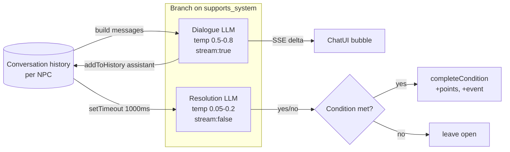

**ASCII:**
```
                +-------------------------------+
                |     conversation history      |
                |   (per-NPC, trimmed to N)     |
                +---------------+---------------+
                                |
              +-----------------+-----------------+
              |                                   |
   buildDialoguePrompt /                 buildResolutionPrompt
   buildUserPromptWithContext                      |
              |                                   |
              v                                   |
   +------------------+        +1 second          |
   |  Dialogue LLM    |   <-- setTimeout ----  evaluateConversation
   | stream:true      |                        |
   | temp 0.5-0.8     |             +----------------------+
   +--------+---------+             | Resolution LLM       |
            |                       | stream:false         |
            | SSE                   | temp 0.05-0.2        |
            v                       +----------+-----------+
   +------------------+                        |  yes / no
   | ChatUI bubble    |                        v
   | (onChunk append) |              +---------+---------+
   +------------------+              | met?               |
                                     |  yes -> +points,   |
                                     |          event,     |
                                     |          checkLevel |
                                     |  no  -> leave open |
                                     +--------------------+
```

---

### Diagram 5: Full Dialogue Round-Trip Sequence

*The most important diagram in this document.*

**Mermaid:**
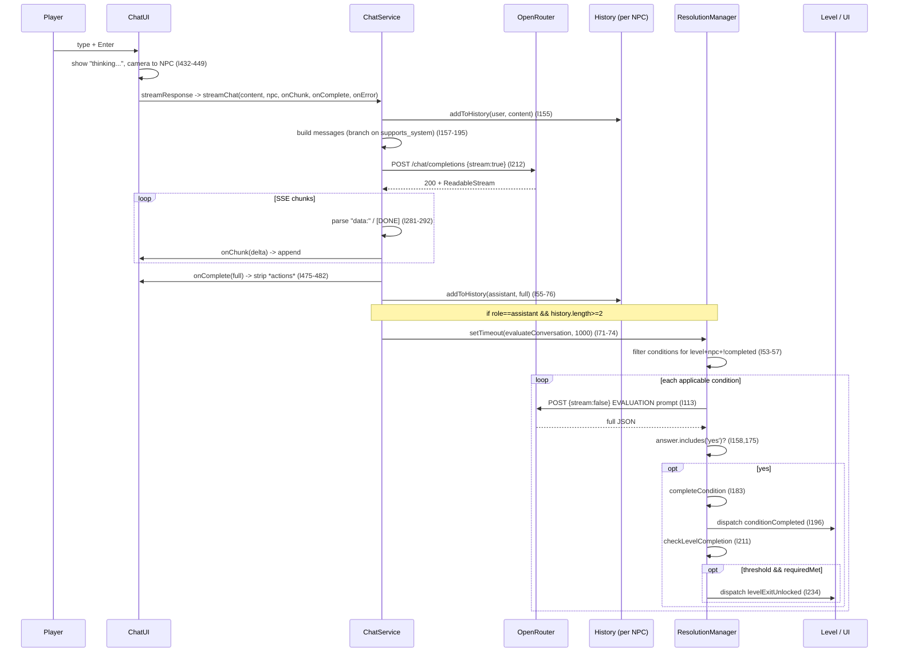

**ASCII:**
```
Player   ChatUI   ChatService   OpenRouter   History   ResolutionMgr   Level/UI
  |         |          |             |          |            |             |
  | type    |          |             |          |            |             |
  +-------->|          |             |          |            |             |
  | "thinking..." + camera->NPC      |          |            |             |
  |         +-------->|             |          |            |             |
  |         |  streamChat(content,npc,on*,on*,on*)         |             |
  |         |          +----------->|          |            |             |
  |         |          | add(user)  +--------->|            |             |
  |         |          | build msgs (branch)   |            |             |
  |         |          | POST stream:true      |            |             |
  |         |          +------------>|          |            |             |
  |         |          |<------------+          |            |             |
  |         |          |  ReadableStream        |            |             |
  |         |<---------| onChunk(delta)*        |            |             |
  |<--------+ render   |                        |            |             |
  |         |<---------| onComplete(full) ----- strip *actions*           |
  |         |          | add(assistant, full)-->|            |             |
  |         |          | if role==assistant && len>=2        |             |
  |         |          | setTimeout(1000) ---->+----------->|             |
  |         |          |                        |   evaluateConversation   |
  |         |          |                        |   filter conditions      |
  |         |          |                        |   for level+npc+!done    |
  |         |          |                        |            |             |
  |         |          |                        |            +--> POST     |
  |         |          |                        |            |   stream:f  |
  |         |          |                        |            |<-- yes/no   |
  |         |          |                        |            |             |
  |         |          |                        |   if yes:  |             |
  |         |          |                        |   +points  |             |
  |         |          |                        |   dispatch conditionCompleted
  |         |          |                        |   checkLevelCompletion   |
  |         |          |                        |   if points>=thr & reqMet:
  |         |          |                        |   dispatch levelExitUnlocked
```

---

### Diagram 6: Prompt Construction Branch Logic

**Mermaid:**
```mermaid
flowchart TD
    Start([streamChat]) --> Q{supportsSystemMessages<br/>(llm.js:192)}
    Q -- true (most models) --> A["Branch A<br/>buildDialoguePrompt -> SYSTEM_DIALOGUE<br/>(llm.js:198, 121)"]
    Q -- false (e.g. gemma-3-27b) --> B["Branch B<br/>buildUserPromptWithContext -> USER_WITH_CONTEXT<br/>(llm.js:208, 125)"]
    A --> Msgs["messages = [{role:system, ...}, ...history]"]
    B --> Msgs2["messages = [{role:user, embedded}, ...history]"]
    Msgs --> Body["body: {model, messages, temp, max_tokens, stream:true}"]
    Msgs2 --> Body
    Body --> Post["POST baseUrl (chatService.js:212)"]
```

**ASCII:**
```
                 streamChat(content, npc)
                          |
                          v
          supportsSystemMessages(currentModel)?
              (config/llm.js:192-195)
              |                       |
           yes|                       | no (gemma-3-27b)
              v                       v
   +-----------------------+   +-----------------------------+
   | Branch A              |   | Branch B                    |
   | buildDialoguePrompt   |   | buildUserPromptWithContext  |
   | SYSTEM_DIALOGUE(name, |   | USER_WITH_CONTEXT(name,     |
   |   persona, questInfo) |   |   persona, questInfo, msg)  |
   +-----------+-----------+   +--------------+--------------+
               |                              |
               v                              v
   messages=[{system}, ...history]   messages=[{user,embedded}, ...history]
               |                              |
               +--------------+---------------+
                              |
                              v
                 body = { model, messages,
                          temperature, max_tokens,
                          stream: true }
                              |
                              v
                 POST baseUrl  (chatService.js:212)
```

---

### Diagram 7: Quest Condition Lifecycle

**Mermaid:**
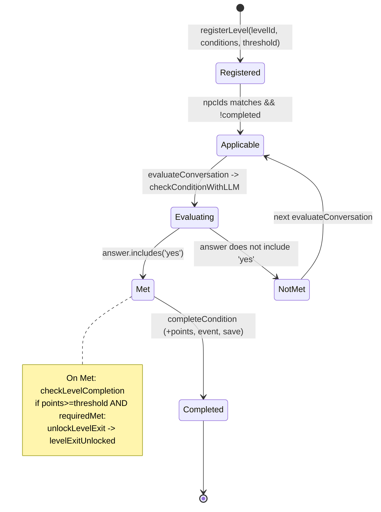

**ASCII:**
```
[Registered]  <-- registerLevel(levelId, conditions, threshold)
     |
     | filter: npcIds matches current npc AND !completedConditions[id]
     v
[Applicable]  -----+
     |             |
     | evaluateConversation -> checkConditionWithLLM
     v             |
[Evaluating]      | (retry on next conversation)
     |             |
     +--- no ------+
     |
     | yes (answer.includes('yes'))
     v
   [Met] ----> completeCondition:
               - completedConditions[id]=true
               - levelPoints[level] += points
               - showNotification
               - dispatch conditionCompleted
               - checkLevelCompletion:
                   if points>=threshold && allRequiredMet:
                       unlockLevelExit -> dispatch levelExitUnlocked
     |
     v
[Completed] (terminal; never re-evaluated)
```

---

# 3 — Level System

## 3.1 Class Hierarchy

`levels/levelGenerator.js` defines the base class. Concrete levels either extend it directly or via the `CustomLevel` intermediate base.

- **`LevelGenerator`** (`levels/levelGenerator.js`):
  - `static LEVEL_BOUNDS` (l7-32): derived from `WORLD_CONFIG.GRID_CELL_SIZE * WORLD_CONFIG.DEFAULT_WORLD_SIZE` = **100×100 m** floor, ceiling y=3, wall height 3.
  - `static DEFAULT_CONFIG` (l35-40): `cellSize:1`, `mazeSize:16`, `skyboxSize:1000`.
  - constructor (l42-61): merges config, sets `window.currentLevel = this` (l58), derives `levelId` from the class name (l55).
  - `createGround(bounds)` (l63-81): `MeshBuilder.CreateGround` with a gold-line `GridMaterial`.
  - `createWalls()` (l83-85): stub returning `[]` — overridden by subclasses.
  - `setupSkybox()` (l87-109): `StandardMaterial` skybox from `config.skyColor`, sets `scene.clearColor`, delegates to `skyboxComponent`.
  - `async createLevel()` (l111-133): calls `setupSkybox → createGround → createWalls`, returns `{ground, walls, cellSize, bounds}`.
  - `dispose()` (l135-157): disposes walls, components, settingsUI, skyboxComponent.

- **`Singapore6Level extends LevelGenerator`** (`levels/singapore6/singapore6Level.js:20`):
  - Overrides `LEVEL_BOUNDS.floor` to **160×160 m** (l21-28). Note: only `floor` is overridden — `ceiling`, `walls`, `room` inherit the base 100 m values because object-spread merges top-level keys. This is benign in practice because Singapore6 overrides `createWalls` to return `[]` (l353-358).
  - `mazeSize: 160` (l33).

- **`CreditsLevel extends LevelGenerator`** (`levels/credits/creditsLevel.js:5`):
  - `LEVEL_BOUNDS.floor` = **40×40 m** (l6-13).
  - Stubs: `createGround() { return null; }` (l60), `createWalls() { return []; }` (l61), `createLevel() { return {}; }` (l62) — no geometry; renders only the credits UI.

- **`CustomLevel extends LevelGenerator`** (`levels/customLevel.js:4`): intermediate base.
  - `LEVEL_BOUNDS.floor` = **80×80 m**, room height **8 m** (l6-18). `mazeSize: 80` (l23).

- **`NightClubLevel extends CustomLevel`** (`levels/nightclub/nightClubLevel.js:14`):
  - `LEVEL_BOUNDS.floor` = **100×100 m**, room height **40 m** (l16-46). Defines custom `entranceArea` and `toiletArea` sub-regions.

- **`TaiyongLevel extends CustomLevel`** (`levels/taiyong/taiyongLevel.js:19`):
  - `LEVEL_BOUNDS.floor` = **80×80 m**, room height **8 m** (l20-32) — identical to `CustomLevel`'s values, so the override is effectively redundant.

- **`GridLevel extends CustomLevel`** (`levels/grid/GridLevel.js:5`):
  - `LEVEL_BOUNDS` uses raw literals `width:200, length:200, height:100` (l6-18) — bypasses the `GRID_CELL_SIZE` multiplier used everywhere else. Tile-based; uses its own `GridConfig.js` + `testLevel.json`.

## 3.2 Level Folder Composition

Each level is a folder under `levels/`. The expected file set (not all levels have all files):

| File | Purpose |
|---|---|
| `*Level.js` | Main level class extending `LevelGenerator` / `CustomLevel` |
| `buildings.js` | Building definitions (positions, dimensions, materials) |
| `lighting.js` | Light placements |
| `npc.js` | NPC manager; constructs the level's NPCs from persona data |
| `quest.js` | Quest condition definitions + `registerLevel` call + event listeners |
| `furniture.js` | Interior/exterior decorations |
| `objectMapping.js` | Asset-key → component mapping |
| `*Effects.js` | Level-specific visual effects (wraps `EffectManager`) |
| `skybox.js` | Skybox texture/material config |
| `vehicles.js` | Vehicle meshes |
| `water.js` | Water rendering config |

**Per-level inventory:**

| Level | Files present |
|---|---|
| `singapore6/` | `buildings.js`, `cityscapeBorder.js`, `furniture.js`, `lighting.js`, `npc.js`, `objectMapping.js`, `quest.js`, `seaBorder.js`, `singapore6Effects.js`, `singapore6Level.js`, `skybox.js`, `vehicles.js`, `water.js` (fullest level) |
| `nightclub/` | `furniture.js`, `lighting.js`, `npc.js`, `objectMapping.js`, `quest.js`, `nightClubLevel.js` (no buildings/effects/skybox/vehicles/water) |
| `taiyong/` | `furniture.js`, `lighting.js`, `npc.js`, `objectMapping.js`, `quest.js`, `skybox.js`, `taiyongDoorTrigger.js`, `taiyongTriggerArea.js`, `taiyongLevel.js`, `vehicles.js` (no buildings/effects/water; has custom trigger helpers) |
| `grid/` | `GridConfig.js`, `GridLevel.js`, `testLevel.js`, `testLevel.json` (completely different tile-based schema) |
| `credits/` | `creditsLevel.js` only (intentionally empty stubs) |

## 3.3 Level Factory

`ui/debugControls.js:84-103` — `getLevelGenerator(levelType, scene)` switch:

```js
case 'singapore6':  return new Singapore6Level(scene);     // l87
case 'ladiesroom':  return new LadiesRoomLevel(scene);     // l89  ⚠ dead: never imported
case 'testcamera':  return new TestCameraCollision(scene); // l91  ⚠ dead: never imported
case 'nightclub':   return new NightClubLevel(scene);      // l93
case 'grid':        return new GridLevel(scene);           // l95
case 'taiyong':     return new TaiyongLevel(scene);        // l97
case 'credits':     return new CreditsLevel(scene);        // l99
default:            return new LevelGenerator(scene);      // l101
```

The `availableLevels` prompt list (`debugControls.js:106`) is `['default', 'singapore6', 'nightclub', 'grid', 'taiyong', 'credits']` — so `ladiesroom` and `testcamera` are unreachable from the UI, but their switch arms would throw `ReferenceError` if ever hit because the symbols are not imported at the top of the file. They are dead code.

## 3.4 Level Progression

- **`LEVEL_ORDER`** lives in `config/levelOrder.js:2-7` (not in `levelProgression.js`):
  ```js
  export const LEVEL_ORDER = ['singapore6', 'taiyong', 'nightclub', 'credits'];
  ```
- **`LevelProgression`** (`quest/levelProgression.js`):
  - constructor (l6-16): binds `changeLevel` listener at l12; calls `showMainMenu()` at l15.
  - `handleLevelChange(event)` (l30-53): disposes main menu, calls `window.recreateScene(event.detail.levelId)` at l49.
  - `goToNextLevel()` (l59-72): asks `getNextLevel()` (`config/levelOrder.js:13-27`) for the next entry after the current level and dispatches `changeLevel { detail: { levelId } }` at l63.
- **'P' key gating** (`ui/controls.js:80-118`): pressing P only triggers progression when `levelPoints[levelId] >= levelThresholds[levelId]` **and** every `required` condition for the level is in `completedConditions` (l89-95). Then it stops the character (l99), stops music (l103), folds level points into the global pool (l106), and calls `window.levelProgression.goToNextLevel()` (l110). In practice, the same threshold+required gate already dispatched `levelExitUnlocked` from `ResolutionManager`, so P is the player-facing confirmation.
- **Main menu** (`quest/mainMenu.js`): instantiates `MainMenuUI`; dispatches `startGame`; `handleStartGame` dispatches `changeLevel { detail: { levelId: LEVEL_ORDER[0] } }` at `mainMenu.js:36`.

## 3.5 Known Issues / Naming Collision

- **`CeilingComponent.js` vs `NEWCeilingComponent.js`** — both export `class CeilingComponent`:
  - `components/CeilingComponent.js:3` — `extends FloorComponent`, has `setColors`, `addLightFixture`, occlusion helpers. **Not imported anywhere in `levels/`** — dead code.
  - `components/NEWCeilingComponent.js:3` — `extends BaseComponent`, uses `CreatePlane` (not `CreateGround`), defaults to a pure-red debug material (`diffuseColor = (1,0,0)` at l31) which both consumers override at runtime. **This is the one actually used** by `levels/nightclub/nightClubLevel.js:5` and `levels/taiyong/taiyongLevel.js:5`.
- **`GridLevel` literal bypass** — uses raw numbers for bounds instead of `GRID_CELL_SIZE` (see [§3.1](#31-class-hierarchy)).
- **Taiyong redundant override** — its `LEVEL_BOUNDS` is byte-identical to `CustomLevel`'s.
- **`DebugControls` dead switch arms** — `ladiesroom` and `testcamera` reference unimported symbols.

---

### Diagram 8: Level Class Hierarchy

**Mermaid:**
```mermaid
classDiagram
    class LevelGenerator {
        +static LEVEL_BOUNDS  100x100m
        +static DEFAULT_CONFIG cellSize1/maze16
        +createGround()
        +createWalls() []
        +setupSkybox()
        +async createLevel()
        +dispose()
        +window.currentLevel = this
    }
    class CustomLevel {
        +LEVEL_BOUNDS 80x80m / h8
    }
    class Singapore6Level {
        +LEVEL_BOUNDS.floor 160x160m
        +createWalls() []
    }
    class CreditsLevel {
        +LEVEL_BOUNDS.floor 40x40m
        +createGround() null
        +createLevel() {}
    }
    class NightClubLevel {
        +LEVEL_BOUNDS.floor 100x100m / h40
    }
    class TaiyongLevel {
        +LEVEL_BOUNDS 80x80m / h8  (redundant)
    }
    class GridLevel {
        +LEVEL_BOUNDS 200x200  (raw literals)
        tile-based schema
    }
    LevelGenerator <|-- Singapore6Level
    LevelGenerator <|-- CreditsLevel
    LevelGenerator <|-- CustomLevel
    CustomLevel <|-- NightClubLevel
    CustomLevel <|-- TaiyongLevel
    CustomLevel <|-- GridLevel
```

**ASCII:**
```
                LevelGenerator   (levels/levelGenerator.js)
                - LEVEL_BOUNDS  floor 100x100m, ceiling y=3, wall h=3
                - DEFAULT_CONFIG cellSize:1, mazeSize:16, skybox:1000
                - createGround/createWalls([])/setupSkybox
                - async createLevel()
                - dispose()
                - sets window.currentLevel = this
                  /  |    \        \________
                 /   |     \                \
   Singapore6Level  |   CustomLevel      CreditsLevel
   floor 160x160m   |   floor 80x80m     floor 40x40m
   createWalls=[]   |   h=8m             createGround()=null
                     |                     createLevel()={}
                     |
         +-----------+-----------+-----------+
         |           |           |           |
   NightClubLevel TaiyongLevel GridLevel
   floor 100x100  floor 80x80   floor 200x200 (raw)
   h=40m          h=8m          tile-based
                  (redundant    GridConfig.js +
                   override)    testLevel.json
```

---

### Diagram 9: Level Folder Composition

**Mermaid:**
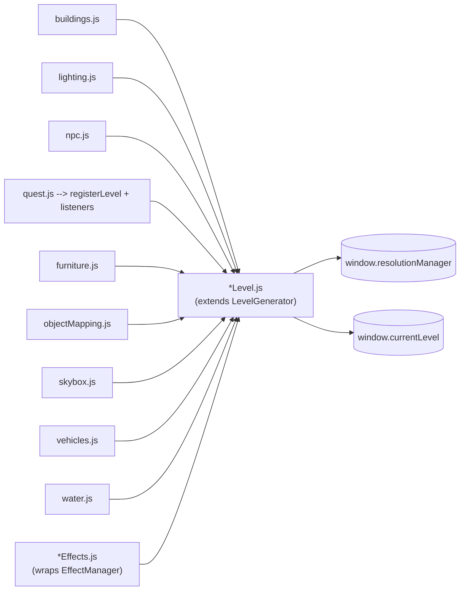

**ASCII:**
```
                      +-----------------------------+
   buildings.js ----> |                             |
   lighting.js -----> |                             |
   npc.js ----------> |      *Level.js              |
   furniture.js ----> |   (extends LevelGenerator)  |
   objectMapping.js > |                             |  sets:
   skybox.js ------> |                             |    window.currentLevel
   vehicles.js ----> |                             |  (and quest.js sets
   water.js -------> |                             |   window.resolutionManager)
   *Effects.js --->  +--------------+--------------+
                                     |
                                     v
                   registers conditions via
                   resolutionManager.registerLevel(...)
```

(Not all levels include every file — see the per-level table in §3.2.)

---

### Diagram 10: Level Progression State Machine

**Mermaid:**
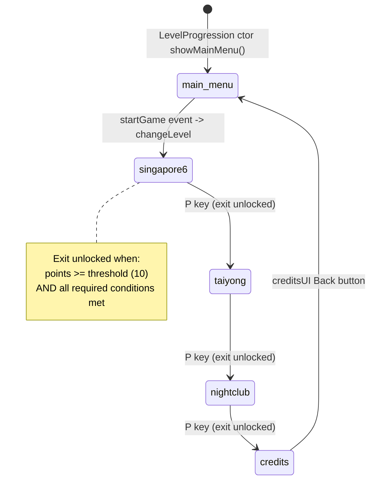

**ASCII:**
```
                       startGame event
        [main_menu] ----------------------> [singapore6]
                                                |
                                                | P key, levelExitUnlocked
                                                v
                                          [taiyong]
                                                |
                                                | P key, levelExitUnlocked
                                                v
                                          [nightclub]
                                                |
                                                | P key, levelExitUnlocked
                                                v
                                           [credits]
                                                |
                                                | Back button
                                                v
                                          [main_menu] (loop)

  Exit-unlock gate (per level):
    levelPoints[level] >= levelThresholds[level]
    AND every required condition in completedConditions
    -> ResolutionManager.unlockLevelExit
    -> dispatch levelExitUnlocked
    -> 'P' key in controls.js then calls goToNextLevel()
```

---

# 4 — NPC System

## 4.1 Persona Data Schema

Each NPC has a data file under `characters/data/`. Canonical schema (e.g. `characters/data/mreed.js`):

| Field | Type | Notes |
|---|---|---|
| `id` | `string` | Unique key; must match `condition.npcIds` entries |
| `name` | `string` | Display name (uppercased in the chat header, `chatUI.js:295`) |
| `animations` | `{ idle, walking, dancing01, dancing02 }` | GLB filenames; some files add `fighting` |
| `defaultAnimation` | `"idle"` | Starting animation |
| `scene` | `string` | Level key the NPC belongs to (informational) |
| `scale`, `rotation` | `number` | Spawn transform |
| `interactionRadius` | `number` | meters; used by `DialogueManager.findClosestNPC` (`DialogueManager.js:80`) |
| `persona` | `string` | The system-prompt voice |
| `initialMemories` | `string[]` | Often empty |
| `questDetails` | `{ relevantInfo[], connections[], playerObjectives[] }` | Fed into `QUEST_INFO` template |

**Schema inconsistencies** (worth flagging):
- `characters/data/npc1.js` and `npc2.js` use a legacy schema: `model` (singular) instead of an `animations` map, no `questDetails`, no `defaultAnimation`. Both set `id: "maggiechow"` (duplicate id). These two files are the basis for the dead `LadiesRoomLevel` switch arm.

## 4.2 NPC Roster

13 persona data files; 12 gameplay subclasses (the 12th, `NPC1`, uses the legacy schema).

| Persona file (`characters/data/`) | id | name | scene (level) |
|---|---|---|---|
| `npc1.js` | maggiechow | Maggie Chow | ladiesroom (legacy) |
| `npc2.js` | maggiechow | Maggie Chow | ladiesroom (legacy, dup id) |
| `maggiechow.js` | maggiechow | Maggie Chow | singaporepolicepost |
| `purple02f.js` | nikazhang | Nika Zhang | ladiesroom |
| `bluef01.js` | linmeihua | Lin Mei Hua | singaporehub |
| `guardm01.js` | khaichen | Khai Loong Chen | corporatetower |
| `orangef01.js` | victorialim | Victoria Lim | singaporeclub |
| `copf01.js` | zaratan | Sergeant Zara Tan | singaporepolicepost |
| `mreed.js` | mreed | Megan Reed | taiyong |
| `maxeen.js` | maxeen | Maxeen | taiyong |
| `csk.js` | csk | Kyehoon Cho | taiyong |
| `bangweitun.js` | bangweitun | Bang Wei Tun | taiyong |
| `tong.js` | tong | Tong | taiyong |

## 4.3 NPCBase Class

`characters/gameplay/NPCBase.js`:

- Constants (l5-13): `DEFAULT_SCALE = 2.0`, `MOVEMENT_SPEED = 0.01`, `ROTATION_SPEED = 0.1`, `MIN_PAUSE_TIME = 2`, `MAX_PAUSE_TIME = 5`, `MIN_WALK_TIME = 4`, `MAX_WALK_TIME = 8`.
- `static States = { IDLE:'idle', WALKING:'walking', LOCKED:'locked' }` (l15-20).
- `static MOVEMENT_PATTERNS = { CIRCLE, FIGURE_8, OVAL, INFINITY }` (l22-28).
- Pattern-switch timer is set inline at l52: `this.patternTimer = this.getRandomTime(15, 30)` (15-30 s).
- `setupChatInteraction()` (l134-154): stores `this.mesh.npc = this` at l137; registers `OnPickTrigger` -> `this.interact()` at l145-150.
- `interact()` (l157-178): `lockMovement()`; lazily constructs `window.chatUI = new ChatUI()` if missing (l164-167); `setNPC(this)` (l170); `show()` (l173); dispatches `lockPlayerControls { detail: true }` (l176-177).
- `updateMovement()` (l271-353): per-frame; if `LOCKED` or no mesh, returns; if a conversation is active, forces IDLE + face-the-player (l275-305); ticks pattern timer (l308-313); ticks state timer and flips IDLE↔WALKING (l316-321); calls `updatePosition()` only when WALKING (l327); lerps rotation toward heading (l344-352).
- `updatePosition()` (l244-269): pattern geometry uses a 5-unit radius around `spawnPosition` — cos/sin for CIRCLE/OVAL, Lissajous for FIGURE_8, Lemniscate for INFINITY.

## 4.4 Movement State Machine

- **IDLE** — paused for a random 2-5 s (`getRandomTime(MIN_PAUSE_TIME, MAX_PAUSE_TIME)`).
- **WALKING** — moves along the active pattern for a random 4-8 s.
- **LOCKED** — entered on `interact()` or on receiving a `lockPlayerControls(true)` style trigger; suppresses all position updates until cleared.
- Every 15-30 s, the active `MOVEMENT_PATTERN` rotates (CIRCLE → FIGURE_8 → OVAL → INFINITY in sequence).

## 4.5 Interaction Flow

Two entry points converge on `NPCBase.interact()`:

1. **Click** — `mesh.actionManager` `OnPickTrigger` (registered at `NPCBase.js:145-150`) calls `this.interact()`.
2. **'E' key** — `quest/DialogueManager.js:23-38` key handler: if `e` pressed and enabled, calls `findClosestNPC()` (`DialogueManager.js:40-84`, which scans all NPCs, picks the closest within `closestNPC.interactionRadius || 3` of the `"PlayerCharacter"` mesh), then `chatUI.setNPC(npc)` (l32), `chatUI.show()` (l33), `lockPlayerControls(true)` (l34).

Either way `interact()` runs: lockMovement → ensure ChatUI → setNPC → show → dispatch `lockPlayerControls(true)`.

## 4.6 Subclass Pattern

12 gameplay subclasses in `characters/gameplay/` (e.g. `maggiechow.js:4`, `mreed.js:4`, `tong.js:4`). 11 of them are byte-for-byte identical except class name and imported data file path. Each:

1. `super(npcData, scene)`.
2. Copies `name / id / interactionRadius / persona / initialMemories / questDetails / currentAnimation='idle'` onto `this`.
3. Overrides `updateMovement()` to call `super.updateMovement()` and then auto-swap the `idle`/`walking` GLB based on `currentState`.

`NPC1` (`characters/gameplay/npc1.js:5`) is the odd one out — it overrides `initialize()` instead, uses the legacy `model` field, and does not do the auto-animation-swap.

**DRY note**: the 11 identical `updateMovement()` overrides are a strong candidate for hoisting into `NPCBase` (the base class already knows `currentState` and could own the swap).

---

### Diagram 11: NPC Movement State Machine

**Mermaid:**
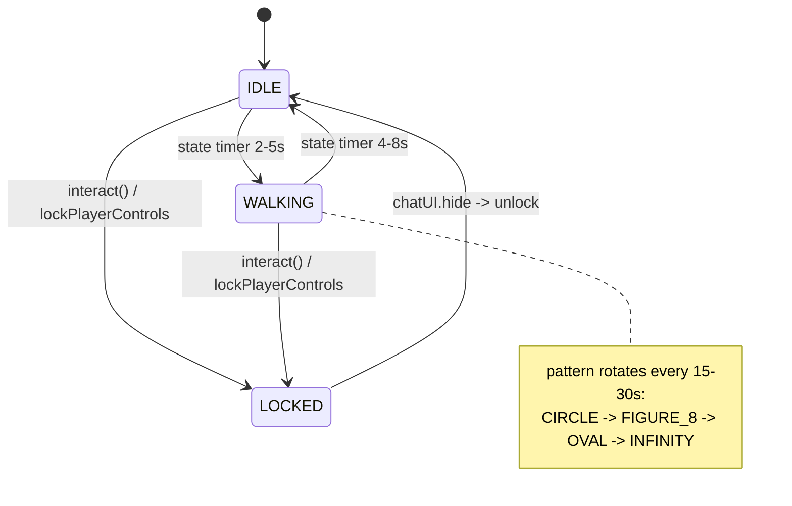

**ASCII:**
```
                      [IDLE]
                        |  ^
          2-5s pause    |  |
        +---------------+  |
        |                  |
        v                  |
                    [WALKING]
        ^   4-8s walk      |
        |                  |
        +------------------+
        (state timer flips IDLE<->WALKING)

   pattern timer (15-30s) rotates MOVEMENT_PATTERN:
        CIRCLE -> FIGURE_8 -> OVAL -> INFINITY

   interact() / lockPlayerControls(true):
        IDLE   ----+
        WALKING---+---> [LOCKED]   (no movement; faces player if convo active)
                              |
                              | chatUI.hide / unlock
                              v
                          [IDLE]
```

---

### Diagram 12: NPC Interaction Sequence

**Mermaid:**
```mermaid
sequenceDiagram
    participant P as Player
    participant M as NPC mesh
    participant NB as NPCBase
    participant DM as DialogueManager
    participant CUI as ChatUI
    participant C as Controls
    participant CS as ChatService

    alt Click path
        P->>M: pointer pick
        M->>NB: OnPickTrigger -> interact() (NPCBase.js:145-150)
    else 'E' key path
        P->>DM: keydown 'e' (DialogueManager.js:23-24)
        DM->>DM: findClosestNPC() (l40-84)
        DM->>CUI: setNPC(npc) (l32)
        DM->>CUI: show() (l33)
        DM->>C: dispatch lockPlayerControls {detail:true} (l34)
    end
    NB->>NB: lockMovement() (l161)
    NB->>CUI: setNPC(this) (l170)
    NB->>CUI: show() (l173)
    NB->>C: dispatch lockPlayerControls {detail:true} (l176-177)
    CUI->>CUI: camera focusOnNPC + dispatch stopCharacterMovement
    Note over CUI,CS: Player types; handleSubmit -> streamResponse -> streamChat (see Diagram 5)
```

**ASCII:**
```
Player        NPC mesh      NPCBase      DialogueManager   ChatUI       Controls
  |              |             |               |              |            |
  | click        |             |               |              |            |
  +------------->|             |               |              |            |
  |  (or 'E')    |             |               |              |            |
  |              | OnPickTrigger              |              |            |
  |              +------------>|              |              |            |
  |              |  interact() |              |              |            |
  |              |             |               |              |            |
  | 'E' key      |             |               |              |            |
  +----------------------------+-------------->|              |            |
  |              |             |  findClosestNPC()           |            |
  |              |             |               | setNPC      |            |
  |              |             |               +------------>|            |
  |              |             |               | show        |            |
  |              |             |               +------------>|            |
  |              |             |               | lockPlayerControls(true) |
  |              |             |               +-------------------------->|
  |              |             |               |              |            |
  |              |             | lockMovement()|              |            |
  |              |             | ensure ChatUI, setNPC(this), show()       |
  |              |             | dispatch lockPlayerControls(true) ------->|
  |              |             |               |              |            |
  |              |             |               |   camera->NPC + stopCharacterMovement
  |              |             |               |              |            |
  | type text   |             |               |              |            |
  +--------------------------------------------------------->|            |
  |              |             |               |  handleSubmit -> streamResponse
  |              |             |               |  -> ChatService.streamChat (Diagram 5)
```

---

# 5 — Rendering Pipeline (Components, Effects, Lighting)

## 5.1 Component System

`components/BaseComponent.js`:

- constructor (l1-12): takes **only `id`**. Initializes `position`, `rotation` (Quaternion), `scale` (1,1,1), `isVisible`, `collisionMesh=null`, `parentNode`, `attachPoints=[]`, `floorOffset=0`.
- `initialize(scene, options)` (l14): `Object.assign(this, options)` to apply caller-supplied fields.
- `loadAsset(assetType, assetId)` (l54-113): `fetch('/assets/<type>/<id>.json')` for metadata; reads `standardDimensions` into `this.dimensions`; validates `metadata.facing` (north/east/south/west); `SceneLoader.ImportMeshAsync('', 'assets/<type>/', '<id>.glb', scene)` at l86-91; applies `scaleFactor`; sets `this.floorOffset = (rawHeight * scale) / 2` at l100-101; positions the bottom at y=0 (`this.position.y = floorOffset` at l104).
- `setWorldPosition(x, z)` (l125-133): floor-contact helper — `position = Vector3(x, floorOffset, z)`; mirrors onto `mesh` and `collisionMesh`.
- `getFloorPosition()` (l116-122): returns y=0 position.

**Concrete subclasses:**

| Class | File | Extends | Key behavior |
|---|---|---|---|
| `WallComponent` | `components/WallComponent.js` | `BaseComponent` | `CreateBox`, `tagList=["wall"]` (l33), `isBlocker=true` (l54), `blockAllLight=true` (l56); `setTransparent()` for glass |
| `DoorComponent` | `components/DoorComponent.js` | `BaseComponent` | `setOpen(open)` (l72-94) toggles `checkCollisions`, `isBlocker`, `visibility`, `isPickable` on both door and centerline meshes; `updateDoorState()` also toggles `blockAllLight` and `ignoreCastShadows` |
| `FloorComponent` | `components/FloorComponent.js` | `BaseComponent` | `MeshBuilder.CreateGround`; `setTiling(x,y)` |
| `CeilingComponent` (legacy) | `components/CeilingComponent.js` | `FloorComponent` | `createCeilingMesh()` calls `super.createFloorMesh()` then rotates π (l17); `addLightFixture()`; **dead code — not imported anywhere** |
| `CeilingComponent` (active) | `components/NEWCeilingComponent.js` | `BaseComponent` | `CreatePlane`, rotates 90°, **defaults to pure red debug material** (l31); the one actually used by nightclub and taiyong |
| `SkyboxComponent` | `components/SkyboxComponent.js` | (none) | `setupSkybox({size, rootUrl, fileNames, customMaterial})`; `infiniteDistance=true`, `renderingGroupId=0` |
| `BlinderComponent` | `components/BlinderComponent.js` | `BaseComponent` | Builds N horizontal slats (`N = floor(height/slatHeight)`); each slat `tagList=["blinder"]`, `isBlocker=true`, `blockAllLight=true` — light-blocking slats |
| `BuildingComponent` | `components/BuildingComponent.js` | `BaseComponent` | `CreateBox` from `config.{height,width,depth}`; `setHighlight()`. Marked legacy/unused |

## 5.2 MaterialFactory

`components/MaterialFactory.js`:

- `materialCache = new Map()` (l4).
- `getWallMaterial(type)` (l7-27): key `wall-<type>`; StandardMaterial diffuse `(0.95,0.95,0.95)`, specular `(0.3,0.3,0.3)` power 32, ambient `(0.2,0.2,0.2)`, `useAmbientInGrayScale=true`.
- `getFloorMaterial(type)` (l29-45): key `floor-<type>`; diffuse `(0.8,0.8,0.8)`, specular `(0.2,0.2,0.2)` power 64, ambient `(0.1,0.1,0.1)`.
- `disposeMaterial(id)` (l47-53).

## 5.3 Component Lifecycle

```
instantiate (new X(id))
   -> initialize(scene, options)      // Object.assign caller options
   -> loadAsset(type, id)             // fetch JSON + import GLB; sets floorOffset
   -> setWorldPosition(x, z)          // floor-contact placement
   -> live (rendered, possibly clustered for lighting)
   -> dispose()                        // on scene dispose
```

## 5.4 Visual Effects

`fx/EffectManager.js`:

- `activeEffects = new Map()` (l12).
- `addEffect(name, config)` (l15-50) — **factory switch**:
  - `'fog'` → `new FogEffect` (l19)
  - `'fog2'` → `new FogEffect2` (l22)
  - `'volumetricLight'` → `new VolumetricLightScatteringPostProcess` wrapper (l25)
  - `'rain'` → `new RainEffect` (l28)
  - `'rain2'` → `new RainEffect2` (l31)
  - `'rain3'` → `new RainEffect3` (l34)
  - `'rain4'` → `new RainEffect4` (l37-41, also `await effect.start()` and early return)
  - after switch: `effect.start()` then `activeEffects.set(name, effect)` (l44-47).
- `removeEffect(name)` (l52-58): `effect.dispose()`, `Map.delete`.
- `update()` (l64-66): `activeEffects.forEach(e => e.update())`.

**Important**: `EffectManager` does **not** register `onBeforeRenderObservable` itself. It exposes a plain `update()` method; each level's `*Effects.js` is responsible for registering the per-frame call (e.g. `singapore6Effects.js` wraps `EffectManager` and subscribes to `scene.onBeforeRenderObservable`). The exception is `RainEffect4`, which self-registers internally.

**Effect types** (all under `fx/`):

| Class | Behavior |
|---|---|
| `FogEffect` | EXP2 fog mode, 3-color cycle (amber/blue/green) |
| `FogEffect2` | LINEAR fog + custom GLSL height-limited post-process shader |
| `VolumetricLightEffect` | `BABYLON.VolumetricLightScatteringPostProcess` |
| `RainEffect` | line-mesh, 2000 drops batched into 100-drop merged meshes |
| `RainEffect2` | line-mesh + camera-follow, 3000 drops, wind 0.2 rad |
| `RainEffect3` | `ParticleSystem`, 8000 particles, emitter follows camera |
| `RainEffect4` | `BABYLON.ParticleHelper.CreateAsync('rain')` + camera-follow observer (self-registers) |
| `NightclubFogEffect` | LINEAR fog synced to "central-cube-light" emissive; density pulse 0.01-0.05 |
| `NightclubLightEffect` | SpotLights + ground-glow quads with radial-gradient `DynamicTexture` |
| `NightclubPanelLightEffect` | animated emissive boxes (panel light board); white/red/green panels |

Note: the three `Nightclub*` effect classes are **not** in `EffectManager.addEffect`'s switch — the nightclub level instantiates them directly.

## 5.5 Light Clustering (key optimization)

**Problem**: Babylon's default shader pipeline limits the number of point lights affecting a single mesh. The game caps this at **3 lights per mesh** (`config/config.js:17` `MAX_LIGHTS_PER_MESH: 3`), but levels define dozens of virtual lights.

**Solution** (`fx/lighting/ClusterManager.js`): a fixed **pool of 3 `BABYLON.PointLight`s** is repositioned every 10 frames to impersonate the most relevant virtual lights from the perspective of the camera.

- **`lightRegistry`** (`Map`, l6): virtual lights registered by the level.
- **`activeLights`** (l7, populated by `createLightPool()` at l21-37): the real pool of 3 `PointLight`s, each starting at intensity 0, `range = 15 m`, warm-white diffuse `(1, 0.98, 0.92)`.
- **`MAX_ACTIVE_LIGHTS`** (l8-9): `options.maxActiveLights || WORLD_CONFIG.LIGHTING.MAX_LIGHTS_PER_MESH || 3`.

**`updateLights()` algorithm** (`ClusterManager.js:93-202`):

1. l99-102 — snapshot the registry into an array.
2. l105 — `scene.getMeshesByTags("wall")` for occluders.
3. l117-127 — **wall occlusion**: for each light, cast `BABYLON.Ray.Intersects(camera.position, dir, wall.boundingBox, wall.worldMatrix)` against each wall; mark `light.isOccluded = true` if any wall blocks.
4. l130-133 — **frustum cull via dot product**: `dot = Dot(cameraForward, cameraToLight.normalize())`; `inFrustum = dot > 0`.
5. l134 — distance from camera.
6. l138-141 — keep only non-occluded lights with `distance < range * 1.5`.
7. l144-151 — sort in-frustum first, then by distance ascending.
8. l154 — `slice(0, MAX_ACTIVE_LIGHTS)` — the top 3.
9. l172-174 — for each selected virtual light, copy position into a pool light and set **`intensity = source.intensity * 0.6`** (40% reduction, matches the plan).
10. l196 — unused pool lights are set to `intensity = 0`.

**Update frequency** — `setupUpdateLoop()` (l204-221): `UPDATE_FREQUENCY = 10` (l207); registers `scene.registerBeforeRender(...)` with a frame counter that calls `updateLights()` every 10 frames.

**Config** (`config/config.js:14-22`, the `LIGHTING` block): `CLUSTER_SIZE:8`, `MAX_LIGHTS_PER_CLUSTER:3`, `MAX_LIGHTS_PER_MESH:3`, `VERTICAL_CLUSTERS:4`, `LIGHT_FADE_START:0.8`, `LIGHT_FADE_END:1.0`, `DEFAULT_LIGHT_RANGE:15`, `PARTICLE_VISIBILITY_RANGE:10.5`.

**Documentation/reality gap**: `CLUSTER_SIZE`, `MAX_LIGHTS_PER_CLUSTER`, and `VERTICAL_CLUSTERS` are declared in config but **not actually used** by `ClusterManager`'s algorithm, which is a flat camera-distance + frustum + ray-occlusion selection — not a spatial 8×8×8 cell subdivision. If you're reading older docs that describe "8×8×8 clusters," that is aspirational, not what the code does.

## 5.6 Camera

`camera.js` (at repo root) — `GameCamera`:

- **Three profiles** (l13-26):
  - `thirdPersonProfile` (default): offset `(0, 2.5, 4)`.
  - `npcFocusProfile`: offset `(0, 2.15, 2.2)`.
  - `waitingProfile`: offset `(0, 2.2, 2.2)`.
- Underlying camera: `BABYLON.UniversalCamera` (l37), `checkCollisions = true` (l44), `ellipsoid = (0.5, 0.5, 0.5)` (l45).
- **Per-frame follow** in `scene.registerBeforeRender` (l49-90):
  - l58 `radius = sqrt(offsetZ² + offsetY²)`.
  - l59-63 build `desiredPosition` from yaw/pitch.
  - **Ray-cast collision**: l66-67 cast `BABYLON.Ray(target, desired-target, radius)` and `scene.pickWithRay(ray)`.
  - l72 on hit, snap to hit point plus a **0.2-unit offset** along the surface normal (prevents clipping through geometry without a physics engine).
  - l80-85 clamp to max 6-unit distance.
- **Mouse-look** (`setupMouseControl`, l93-105): sensitivity 0.002 on both axes; pitch clamped to **±60°** (`±π/3`, l100-102). Notably the look activates on `ChatUI.isActive || isPointerLock` — an intentional OR so the player can look around while the chat is open.
- **Focus helpers**: `focusOnNPC(npc)` (l111-117), `clearNPCFocus()` (l119-124), `focusOnPlayer()` (l126-132), `clearWaitingFocus()` (l134-138).

## 5.7 Player Character

`characters/pc/maincharacter.js` — `loadCharacters(scene)`:

- l7 `basePath = "./assets/characters/pc/"`.
- l6 loads `pc.json` for `standardDimensions` + `scaleFactor`.
- l10-18 imports 7 GLBs in parallel:

| Semantic | GLB |
|---|---|
| idle | `pdenton_idle.glb` |
| forward (walk) | `pdenton_walk.glb` |
| backward | `pdenton_walkb.glb` |
| strafe left | `pdenton_sleft.glb` |
| strafe right | `pdenton_sright.glb` |
| run | `pdenton_run.glb` |
| dance | `pdenton_dance.glb` |

- l110-116 initial visibility: only `idleCharacter` `setEnabled(true)`; all others `setEnabled(false)`.
- Movement swaps meshes by visibility (no animation blending across a single skeleton). See `ui/controls.js:150-188` for the priority logic.

---

### Diagram 13: Component Class Hierarchy

**Mermaid:**
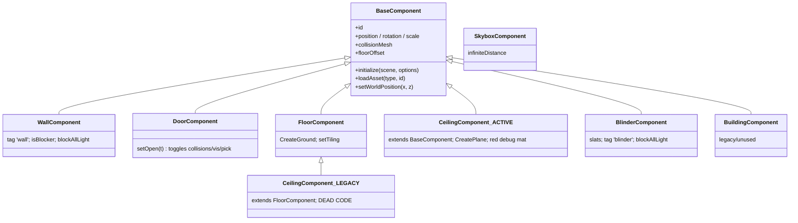

**ASCII:**
```
              BaseComponent  (components/BaseComponent.js)
              - constructor(id) only
              - initialize(scene, options) Object.assign
              - loadAsset(type,id): fetch JSON + import GLB, set floorOffset
              - setWorldPosition(x,z): floor-contact
                  /    |    \      \         \            \
                 /     |     \      \         \            \
   WallComponent  DoorComponent  FloorComponent  BlinderComponent  BuildingComponent
   tag 'wall'     setOpen()      CreateGround    slats; tag        legacy/unused
   isBlocker      toggles        setTiling       'blinder'
   blockAllLight  collisions                       blockAllLight
                 / visibility
                 / pickable
                        |
                        | extends
                        v
              CeilingComponent (LEGACY, components/CeilingComponent.js)
              extends FloorComponent, addLightFixture, DEAD CODE

   CeilingComponent (ACTIVE, components/NEWCeilingComponent.js)
   extends BaseComponent, CreatePlane, defaults to red debug material
   -> used by nightclub + taiyong
```

---

### Diagram 14: Light Clustering Optimization Pipeline

**Mermaid:**
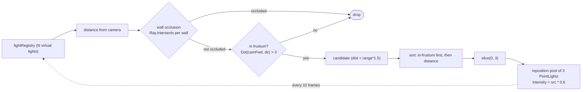

**ASCII:**
```
   lightRegistry (N virtual lights)
            |
            v
   +-------------------+      per light:
   | distance(camera)  |        |
   +---------+---------+        v
             |          wall occlusion: Ray.Intersects(camera->light, each wall)
             v                |
   +-------------------+       | occluded? ----> [drop]
   | frustum cull      |       v
   | Dot(forward,dir)>0|--no-> [drop]
   +---------+---------+
             | yes
             v
   +-------------------+
   | dist < range*1.5  |----no---> [drop]
   +---------+---------+
             | yes
             v
   +-------------------+
   | sort: in-frustum  |
   | first, then dist  |
   +---------+---------+
             |
             v
       slice(0, 3)   <-- MAX_ACTIVE_LIGHTS
             |
             v
   +--------------------------------------+
   | reposition pool of 3 PointLights:    |
   |   position.copyFrom(src)             |
   |   intensity = src.intensity * 0.6    |
   |   unused pool lights: intensity = 0  |
   +--------------------------------------+
             ^
             |  fires every 10 frames via
             |  scene.registerBeforeRender
             +---------------------------+
                                         |
   (loop back to registry snapshot)      |
```

---

### Diagram 15: Effect Manager Update Loop

**Mermaid:**
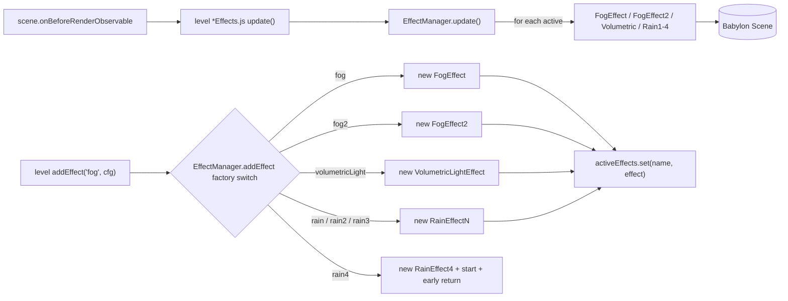

**ASCII:**
```
   scene.onBeforeRenderObservable
            |
            v
   level *Effects.js (e.g. singapore6Effects.js) update()
            |
            v
   EffectManager.update()
            |
            +-- for each effect in activeEffects: effect.update()
            |       |
            |       v
            |   FogEffect / FogEffect2 / Volumetric / Rain1-4 -> mutate scene
            |
            v
        Babylon Scene (fog mode, post-process, particles)

   ------------------ addEffect path ------------------
   level calls effectManager.addEffect(name, config)
            |
            v
   factory switch (EffectManager.js:15-50)
            |-- 'fog'            -> new FogEffect
            |-- 'fog2'           -> new FogEffect2
            |-- 'volumetricLight'-> new VolumetricLightEffect
            |-- 'rain'           -> new RainEffect
            |-- 'rain2'          -> new RainEffect2
            |-- 'rain3'          -> new RainEffect3
            \-- 'rain4'          -> new RainEffect4; await start(); return
            |
            v
   effect.start(); activeEffects.set(name, effect)
```

(Note: `NightclubFogEffect`, `NightclubLightEffect`, `NightclubPanelLightEffect` are instantiated directly by the nightclub level, not via the `addEffect` switch.)

---

# 6 — UI Layer & Event System

## 6.1 UI Inventory

| Component | File | Trigger | Role |
|---|---|---|---|
| Chat UI | `ui/chatUI.js` | 'E' / click | DOM overlay; `handleSubmit` → `streamResponse` → `chatService.streamChat` with `onChunk/onComplete/onError` callbacks; filters `*action text*` |
| Controls | `ui/controls.js` | WASD / SHIFT / P / K | Movement (base 0.04, sprint ×8), P level change, K dance, 7-mesh animation switching, ray-cast collision |
| Debug Controls | `ui/debugControls.js` | L / F / 1 | Singleton; level factory `getLevelGenerator`; FPS toggle; debug overlay toggle |
| Debug UI | `ui/debugUI.js` | toggle (1 key) | Position/rotation readout; API error banner (401/403/429/500/502/503/504) |
| Quest Journal | `quest/questJournal.js` | J / Esc | Lists completed conditions; dispatches `lockPlayerControls` + `stopCharacterMovement` on open |
| Settings UI | `quest/settingsUI.js` | O / Esc | Radio model selector; persists to `localStorage`; dispatches `modelChanged` via the setter |
| Main Menu UI | `ui/mainMenuUI.js` | boot | Dispatches `startGame` → `mainMenu.js` dispatches `changeLevel` |
| Credits UI | `ui/creditsUI.js` | end of game | Shows credits; Back button → `showMainMenu()` |

## 6.2 Input Mapping

| Key | Action | Handler | Effect |
|---|---|---|---|
| W/A/S/D | move | `ui/controls.js:208-215` | base 0.04; forward 0.03; backward 0.01; strafe 0.03 |
| SHIFT+W | sprint | `ui/controls.js:208-210` | forward × 8 = 0.24 |
| P | next level | `ui/controls.js:80-118` | gated on `levelPoints>=threshold && allRequiredMet`; then `goToNextLevel()` |
| K | dance | `ui/controls.js:154-158` | toggles `danceCharacter` mesh |
| E | interact | `quest/DialogueManager.js:23-38` | `findClosestNPC` → open chat |
| J | journal | `quest/questJournal.js:102` | toggle journal (disabled while `ChatUI.isActive`) |
| O | settings | `quest/settingsUI.js:121` | toggle settings (disabled while chat active) |
| L | level select | `ui/debugControls.js:46-48` | `prompt()` with `availableLevels` |
| F | FPS toggle | `ui/debugControls.js:49-50` | toggles FPS display |
| 1 | debug overlay | `ui/debugControls.js:52-53` | toggles FPS + dispatches `toggleDebugOverlay` |
| ESC | close active window | each UI's own handler | closes chat / journal / settings |
| Mouse move (pointer-locked or chat-active) | look | `camera.js:93-105` | yaw/pitch; pitch clamped ±60° |

**Quirk**: in `ui/controls.js:181-186` the A and D strafe meshes are swapped — pressing A enables `rightCharacter`, pressing D enables `leftCharacter` (commented "Swapped from leftCharacter/rightCharacter"). Worth verifying this still matches the visual intent.

## 6.3 User Settings Flow

`quest/userSettings.js` — singleton:

- l9 `static instance = null`; constructor returns existing instance (l22-25).
- l32 sets `window.userSettings = this`.
- Persistence: load at l51 `localStorage.getItem('selectedLLM')`; save at l77 `localStorage.setItem('selectedLLM', modelId)`. l42-48 one-time migration from `sessionStorage`.
- l95 exports `userSettings` (already-constructed singleton).
- **`currentModel` setter** (l65-86): validates, saves to localStorage, dispatches `modelChanged { detail: { modelId } }` at l80-83.

**`modelChanged` flow**:
1. User picks a model in SettingsUI → Save → `settingsUI.js:263` `userSettings.currentModel = selectedLLM`.
2. The setter dispatches `modelChanged` (`userSettings.js:80`).
3. `quest/chatService.js:12` listener `_handleModelChange` → `this.model = userSettings.currentModel` (l23).
4. `quest/ResolutionManager.js:18` listener `_handleModelChange` → `this.evaluationModel = userSettings.currentModel` (l37).
5. Next conversation uses the new model id; the per-model dialogue/resolution profiles are still pulled from `config/llm.js`.

## 6.4 Event-Driven Architecture

The event bus is the primary decoupling mechanism — subsystems almost never import each other directly. Full catalog (dispatcher → listener with payload and purpose):

| Event | Dispatcher → Listener | Payload | Purpose |
|---|---|---|---|
| `changeLevel` | `levelProgression.js:63` / `mainMenu.js:36` → `levelProgression.js:12` / `MusicManager.js:16` | `{ levelId }` | Scene swap + music transition |
| `conditionCompleted` | `ResolutionManager.js:196` → `singapore6/quest.js:26` / `taiyongLevel.js:406` | `{ conditionId, levelId }` | Level-specific reactions (path resolution, door state) |
| `levelExitUnlocked` | `ResolutionManager.js:234` → `singapore6/quest.js:18` / `nightclub/quest.js:18` / `taiyong/quest.js:18` / `nightClubLevel.js:74` | `{ levelId }` | Surface "exit now open" notification |
| `lockPlayerControls` | `chatUI.js:339/381`, `questJournal.js:168/182`, `settingsUI.js:291/306`, `DialogueManager.js:87`, `NPCBase.js:176` → `controls.js:30` | `boolean` | Freeze/unfreeze WASD during modal UIs |
| `stopCharacterMovement` | `chatUI.js:343`, `questJournal.js:172`, `settingsUI.js:295` → `controls.js:34` | — | Snap character to idle immediately |
| `modelChanged` | `userSettings.js:80` → `chatService.js:12` / `ResolutionManager.js:18` | `{ modelId }` | Hot-swap runtime LLM |
| `toggleDebugOverlay` | `debugControls.js:80` → `debugUI.js:57` | — | '1' key toggles overlay |
| `globalPointsUpdated` | `ResolutionManager.js:356` → **none** | `{ globalPoints }` | Orphaned; dispatched but never listened for |
| `npcInteraction` | **none** → `singapore6/quest.js:13` / `nightclub/quest.js:13` / `taiyong/quest.js:13` | `{ npcId }` (intended) | Orphaned; listened for but never dispatched |
| `startGame` | `mainMenuUI.js:68` → `mainMenu.js:15` | — | Main menu → first level |

**Cleanup opportunities** (flagged for future work, not fixed here):
- `globalPointsUpdated` dispatcher in `ResolutionManager.js:356` has no consumer.
- `npcInteraction` listeners in the three level `quest.js` files have no producer.
- The two `lockPlayerControls(true)` paths (DialogueManager 'E' key and NPCBase.interact) are redundant — the chat `show()` already dispatches it.

## 6.5 Collision Detection

There is **no physics engine**. All collision is ray-based:

- **Camera collision** (`camera.js:66-85`): ray from target to desired camera position; on hit, snap to hit point + 0.2-unit offset along the normal; clamp to 6-unit max distance.
- **Character collision** (`ui/controls.js:218-242`): cast `scene.pickWithRay(ray, predicate)` where the predicate at l231 is `mesh.checkCollisions === true && !mesh.isWalkthrough`. On no hit, apply the new position; otherwise the character stays put. `WallComponent` sets `checkCollisions` via `collisionMesh` and `isBlocker`; `DoorComponent.setOpen(false)` re-enables collision.
- **Light occlusion** (`ClusterManager.js:117-127`): `BABYLON.Ray.Intersects(camera.position, dir, wall.boundingBox, wall.worldMatrix)` per wall per light.

---

### Diagram 16: Event Bus Topology

*The wiring diagram for the whole codebase.*

**Mermaid:**
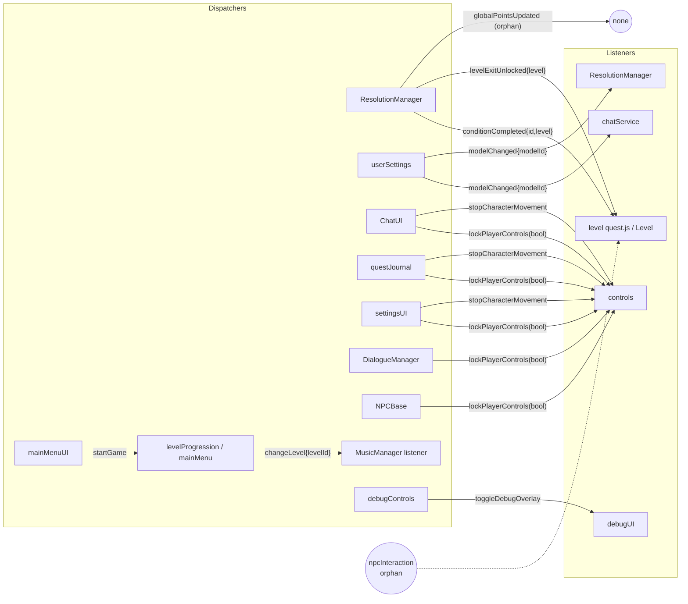

**ASCII:**
```
DISPATCHERS                                EVENTS                              LISTENERS

ChatUI.show/hide        ---> lockPlayerControls(boolean)   ---> controls (movementLocked)
questJournal show/hide  ---> lockPlayerControls(boolean)   ---^
settingsUI show/hide    ---> lockPlayerControls(boolean)   ---^
DialogueManager (E key) ---> lockPlayerControls(boolean)   ---^
NPCBase.interact        ---> lockPlayerControls(boolean)   ---^

ChatUI.show             ---> stopCharacterMovement         ---> controls.stopCharacterMovement()
questJournal show       ---> stopCharacterMovement         ---^
settingsUI show         ---> stopCharacterMovement         ---^

ResolutionManager       ---> conditionCompleted{id,level}  ---> level quest.js (path checks)
                                                                taiyongLevel (door state)
ResolutionManager       ---> levelExitUnlocked{level}      ---> level quest.js (notification)
ResolutionManager       ---> globalPointsUpdated{pts}      ---> [ORPHAN: no listener]

userSettings (setter)   ---> modelChanged{modelId}         ---> chatService._handleModelChange
                                                             ---> ResolutionManager._handleModelChange

levelProgression        ---> changeLevel{levelId}          ---> levelProgression.handleLevelChange
mainMenu                                                    ---> MusicManager._handleLevelChange

debugControls ('1')     ---> toggleDebugOverlay            ---> debugUI.toggle()

mainMenuUI (Start)      ---> startGame                     ---> mainMenu.handleStartGame

[nobody]                -·-> npcInteraction                -·-> level quest.js (dead listeners)
```

---

### Diagram 17: UI Component Interaction Map

**Mermaid:**
```mermaid
flowchart LR
    K({Keyboard / Mouse})
    K -- E --> DM[DialogueManager]
    K -- click --> NB[NPC mesh -> NPCBase]
    K -- WASD/SHIFT/K --> CTRL[controls]
    K -- P --> CTRL
    K -- J --> QJ[questJournal]
    K -- O --> SU[settingsUI]
    K -- L/F/1 --> DC[debugControls]
    K -- Esc --> ANY[active UI hide]

    DM --> CUI[ChatUI]
    NB --> CUI
    CUI --> CS[ChatService.streamChat]
    CS --> OR[(OpenRouter)]
    CS -- addToHistory --> RM[ResolutionManager setTimeout 1000]
    CUI -- show/hide -->|lockPlayerControls / stopCharacterMovement| CTRL
    SU -- save --> US[userSettings]
    US -- modelChanged --> CS
    US -- modelChanged --> RM
    QJ -- show/hide -->|lockPlayerControls| CTRL
    DC -- toggleDebugOverlay --> DUI[debugUI]
    DC -- getLevelGenerator --> MAIN[main.recreateScene]
    CTRL -- P gated --> LP[levelProgression.goToNextLevel]
```

**ASCII:**
```
                       +---------------------------+
                       |  Keyboard / Mouse (input) |
                       +-------------+-------------+
                                     |
   +------+-----+------+----+--------+-------+--------+----+
   |      |     |      |    |        |       |        |    |
   v      v     v      v    v        v       v        v    v
  [E]  [click] [WASD] [P]  [J]      [O]     [L/F/1]  [Esc]
   |      |     |      |    |        |       |        |
   v      v     v      v    v        v       v        v
 DialogueMgr  controls controls questJournal settings debugControls  (any UI)
   |     \      |        |       |          |       |
   |      \---->+        |       |          |       +---> debugUI.toggle (toggleDebugOverlay)
   v             |       |       |          |
 NPCBase         |       |       |          +---> userSettings.currentModel =
   |             |       |       |                = selectedLLM  (dispatches modelChanged)
   v             |       |       |
 ChatUI          |       |       |
   |  show/hide  |       |       |
   |  dispatch   |       |       |
   |  lockPlayerControls / stopCharacterMovement --> controls
   |             |       |
   v             |       |
 ChatService.streamChat  |
   |             |       |
   v             |       |
 OpenRouter      |       |
   |             |       |
   v             |       |
 addToHistory ---+--> (setTimeout 1000) --> ResolutionManager
   (assistant)                                |
                                              v
                                  conditionCompleted / levelExitUnlocked
                                  -> level quest.js / Level reactions

   controls 'P' (gated on points>=threshold && required met)
        |
        v
   levelProgression.goToNextLevel() -> changeLevel -> recreateScene
```

---

## Appendix — Cross-Reference Index

Verified `file:line` anchors used throughout this document:

| Topic | Anchor |
|---|---|
| BABYLON globals | `index.ts:16-18` |
| ChatUI bootstrap | `index.ts:23-26`, `ui/chatUI.js:15` |
| `initGame` | `main.ts:115` |
| Engine + render loop | `main.ts:122`, `main.ts:141-145` |
| `createScene` | `main.ts:23-113` |
| `loadCharacters` | `characters/pc/maincharacter.js:10-18` |
| `recreateScene` + window assignment | `main.ts:163-168`, `main.ts:171` |
| Level base class | `levels/levelGenerator.js:7-157` |
| Level factory switch | `ui/debugControls.js:84-103` |
| Level order | `config/levelOrder.js:2-7` |
| Level progression | `quest/levelProgression.js:30-72` |
| 'P' key gating | `ui/controls.js:80-118` |
| `LEVEL_BOUNDS` overrides | `singapore6Level.js:21-28`, `creditsLevel.js:6-13`, `customLevel.js:6-18`, `nightClubLevel.js:16-46`, `taiyongLevel.js:20-32`, `GridLevel.js:6-18` |
| NPC states/patterns | `characters/gameplay/NPCBase.js:15-28` |
| NPC timers | `characters/gameplay/NPCBase.js:10-13`, `52` |
| NPC `interact` | `characters/gameplay/NPCBase.js:157-178` |
| NPC `updateMovement` | `characters/gameplay/NPCBase.js:271-353` |
| `DialogueManager.findClosestNPC` | `quest/DialogueManager.js:40-84` |
| ChatService `streamChat` | `quest/chatService.js:108-394` |
| SSE parsing | `quest/chatService.js:256-342` |
| 1s delayed evaluation | `quest/chatService.js:69-74` |
| `addToHistory` | `quest/chatService.js:55-76` |
| `evaluateConversation` | `quest/ResolutionManager.js:48-81` |
| `checkConditionWithLLM` | `quest/ResolutionManager.js:93-181` |
| `completeCondition` | `quest/ResolutionManager.js:183-209` |
| `checkLevelCompletion` | `quest/ResolutionManager.js:211-227` |
| `unlockLevelExit` | `quest/ResolutionManager.js:229-239` |
| `LLM_CONFIG.MODELS` | `config/llm.js:9-100` |
| Prompt templates | `config/llm.js:118-168` |
| Branch helpers | `config/llm.js:192-211` |
| `AVAILABLE_MODELS` | `config/models.js:12-19` |
| `WORLD_CONFIG` + `LIGHTING` | `config/config.js:6-23` |
| Singapore6 conditions | `levels/singapore6/quest.js:38-183` |
| Singapore6 threshold (10) | `levels/singapore6/quest.js:187` |
| `BaseComponent` | `components/BaseComponent.js:1-133` |
| `ClusterManager` pool | `fx/lighting/ClusterManager.js:6-37` |
| `updateLights` algorithm | `fx/lighting/ClusterManager.js:93-202` |
| Update frequency | `fx/lighting/ClusterManager.js:204-221` |
| EffectManager | `fx/EffectManager.js:12-66` |
| Camera profiles + ray cast | `camera.js:13-90` |
| Pitch clamp ±60° | `camera.js:100-102` |
| `userSettings` | `quest/userSettings.js:9-95` |
| `modelChanged` dispatch | `quest/userSettings.js:80` |

---

*Document conventions and diagrams mirror the format requested in the plan: each diagram appears in both Mermaid and ASCII. Line numbers are accurate as of the commit at the time of writing; verify with `git blame` if the code has moved.*
