# Agentic Loop & Quest Resolution — Quick Reference

> A single-page, source-annotated map of the dual-LLM pipeline that drives
> NPC dialogue and quest progression. For the full treatment see
> [`ARCHITECTURE.md` §2](ARCHITECTURE.md#2--llm-dialogue--quest-system).

**What this is.** Despite the name, there is **no autonomous agent** in this
project — no tool-calling, no ReAct loop, no multi-step self-prompting. The
"loop" is **reactive**: each player message fires exactly **two** LLM calls
in sequence — a *streaming dialogue* leg, then a *cold yes/no resolution* leg
that decides whether a quest condition was satisfied. One turn = one cycle.

**The cast**
| Role | Class | File |
|---|---|---|
| UI surface | `ChatUI` | `ui/chatUI.js` |
| Dialogue LLM client | `ChatService` | `quest/chatService.js` |
| Resolution LLM client | `ResolutionManager` | `quest/ResolutionManager.js` |
| Prompt templates | — | `config/llm.js` |
| Quest definitions | per level | `levels/<level>/quest.js` |

---

## Diagram (Mermaid)

```mermaid
flowchart TD
    START([Player presses E near NPC]):::entry

    subgraph ENTRY[Entry — either path]
        DM["DialogueManager.findClosestNPC<br/>DialogueManager.js:40"]:::src
        NB["NPCBase.interact (click)<br/>NPCBase.js:157"]:::src
    end
    START --> ENTRY
    ENTRY --> SHOW["ChatUI.show · lock controls<br/>chatUI.js:328"]:::src

    SHOW --> SUBMIT["handleSubmit<br/>chatUI.js:427"]:::src
    SUBMIT --> LEG1

    subgraph LEG1[Leg 1 — Dialogue LLM · streaming]
        HU["addToHistory npc,user<br/>chatService.js:155"]:::src
        BP{"supportsSystemMessages?<br/>chatService.js:161"}:::gate
        REQ1["POST OpenRouter<br/>stream:true · temp .5–.8<br/>chatService.js:212"]:::llm
        SSE["SSE tokens → onChunk → UI<br/>chatService.js:268"]:::src
        HA["addToHistory npc,assistant<br/>chatService.js:370"]:::src
        HU --> BP --> REQ1 --> SSE --> HA
    end

    HA --> TRIG{"trigger:<br/>role=assistant ∧ len≥2<br/>chatService.js:69"}:::gate
    TRIG -->|setTimeout 1000ms| LEG2

    subgraph LEG2[Leg 2 — Resolution LLM · non-streaming · 1s later]
        EVAL["evaluateConversation<br/>ResolutionManager.js:48"]:::src
        FILT["filter: level+npc+!completed<br/>ResolutionManager.js:53"]:::src
        LOOP{"for each condition (await)<br/>ResolutionManager.js:70"}:::gate
        REQ2["POST OpenRouter<br/>stream:false · temp .05–.2<br/>ResolutionManager.js:113"]:::llm
        DEC{"answer.includes yes?<br/>ResolutionManager.js:175"}:::gate
        EVAL --> FILT --> LOOP --> REQ2 --> DEC
        DEC -->|no| RETRY["stays open · re-eval next turn"]:::out
    end

    DEC -->|yes| DONE["completeCondition<br/>+points · mark · notify<br/>dispatch conditionCompleted<br/>ResolutionManager.js:183"]:::out
    DONE --> LVL{"points≥threshold<br/>∧ all required met?<br/>ResolutionManager.js:211"}:::gate
    LVL -->|yes| UNLOCK["dispatch levelExitUnlocked<br/>ResolutionManager.js:229"]:::out
    UNLOCK --> NEXT([Player can press P → next level])
    LVL -->|no| NEXTCYCLE([Next message repeats cycle])

    classDef entry fill:#2d4a2d,color:#fff;
    classDef src fill:#1f3a5f,color:#fff;
    classDef llm fill:#5f3a1f,color:#fff;
    classDef gate fill:#4a2d4a,color:#fff;
    classDef out fill:#1a4a4a,color:#fff;
```



---

## Diagram (ASCII)

```
  Player presses E near NPC
        │
        ▼
  ┌──────────────── ENTRY ────────────────┐
  │ DialogueManager.findClosestNPC :40    │   (or NPCBase.interact :157 on click)
  │   → ChatUI.show · lock controls  :328 │
  └──────────────┬───────────────────────┘
                 ▼
        ChatUI.handleSubmit :427
                 │
                 ▼
 ═══ LEG 1 · DIALOGUE LLM (stream:true, temp .5–.8) ═══
   addToHistory(npc,'user',msg)          chatService.js:155
   build prompt ── branch ──┐            chatService.js:161
     ├─ system-capable:    │  supportsSystemMessages?
     │   [system, …history]│
     └─ Gemma/others:
         [user w/ embedded context]      chatService.js:165
   POST OpenRouter /chat/completions     chatService.js:212
   SSE read loop → onChunk → UI live     chatService.js:268
   addToHistory(npc,'assistant',full)    chatService.js:370
                 │
                 ▼
   TRIGGER  role=='assistant' && len>=2  chatService.js:69
   setTimeout( ──── 1000ms ──── )
                 │
                 ▼
 ═══ LEG 2 · RESOLUTION LLM (stream:false, temp .05–.2) ═══
   evaluateConversation(npcId,history)   ResolutionManager.js:48
   filter: level + npcIds ∋ npc + !done  ResolutionManager.js:53
   FOR EACH condition (sequential await) ResolutionManager.js:70
     buildResolutionPrompt(conv, cond)   llm.js:143
     POST OpenRouter                     ResolutionManager.js:113
     answer = choices[0].content.trim()  ResolutionManager.js:158
     GATE: answer.includes('yes')?       ResolutionManager.js:175
        ├─ NO  → condition stays open (re-evaluated next message)
        └─ YES → completeCondition       ResolutionManager.js:183
                  · completedConditions[id]=true
                  · levelPoints += cond.points
                  · showNotification
                  · dispatch 'conditionCompleted'
                  · checkLevelCompletion  ResolutionManager.js:211
                       │
                       ▼
                  points≥threshold ∧ allRequiredMet?
                       ├─ NO  → exit stays locked
                       └─ YES → dispatch 'levelExitUnlocked'
                                ResolutionManager.js:229
                                → Player can press P
                                   (controls.js:80)
```

---

## Key decision points

- **Branch gate** (`chatService.js:161`) — models without system-message support
  (e.g. Gemma 3) get persona+quest context folded into a single user turn;
  system-capable models get a proper system message + history tail.
- **Resolution trigger** (`chatService.js:69`) — fires *only* on assistant
  messages once history ≥ 2. The 1 s delay avoids blocking the UI and
  prevents double-fire during rapid typing.
- **The sole judgment gate** (`ResolutionManager.js:175`) —
  `answer.includes('yes')`. Everything else (including exceptions and empty
  responses) falls through as **no** → **fail-closed**. Quests cannot
  complete by accident; they can get *stuck* silently if the LLM misbehaves.
- **Sequential condition fan-out** (`ResolutionManager.js:70`) — N applicable
  conditions = N sequential LM calls per turn. Cost amplifier; see
  [`tradeoffs.md` T1.2](tradeoffs.md).

## Condition schema (`levels/<level>/quest.js`)

```js
{ id, points, condition, npcIds, required, pathId?, resolvesLevel? }
```

`condition` is a natural-language yes/no question (e.g. *"Did the player learn
about Tai Yong Medical's recruitment activities?"*). `required` gates level
exit; `resolvesLevel` auto-completes the level.

## Persistence

- `sessionStorage['gameProgress']` stores `completedConditions`, `levelPoints`,
  `globalPoints` — saved in `ResolutionManager.js:281`, reloaded `:295`.
- Cleared on full page reload (`ResolutionManager.js:24-27`).

## Known sharp edges

- `clearHistory()` is a **no-op** — the "Goodbye" button keeps history
  (`chatService.js:82-97`). See [`tradeoffs.md` T5.3](tradeoffs.md).
- Dual entry paths (E-key vs click) can spawn **two ChatService instances**
  with split histories — [`tradeoffs.md` T4.3](tradeoffs.md).
