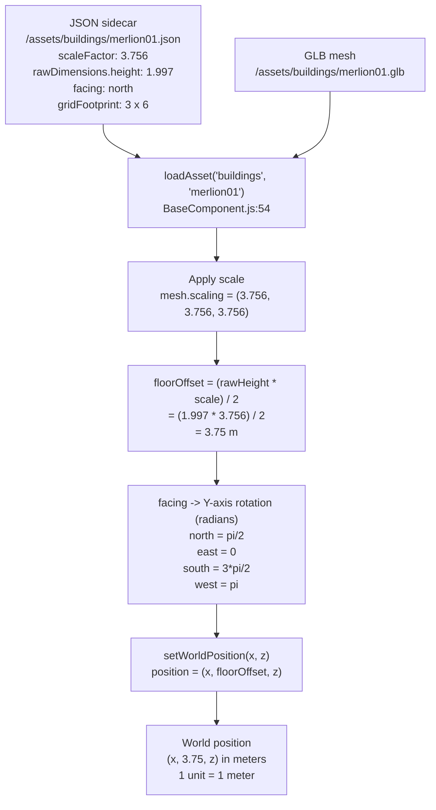

# Video Diagram 1: Asset Metadata → World Grid

**Beat:** ~1:00  ·  **Claim:** A GLB plus its JSON sidecar resolves to a precise world position on the 1-unit = 1-meter grid.

## Diagram

## Speaker Notes (beat ~1:00)

- Every prop in the scene is two files: a binary GLB mesh and a hand-authored JSON sidecar. The mesh is dumb geometry; the sidecar is the brain.
- The sidecar carries four numbers that matter: `scaleFactor`, `rawDimensions`, `facing`, and `gridFootprint`. Take `merlion01` as a concrete example — scaleFactor 3.756, raw height 1.997, facing "north".
- `loadAsset` reads the JSON, fetches the GLB, and runs a three-step transform: scale the mesh, lift it so its base sits on the floor (`floorOffset = rawHeight * scale / 2`), and rotate it to the `facing` direction in radians.
- The final `setWorldPosition(x, z)` drops it onto the grid at `(x, floorOffset, z)` — and because 1 Babylon unit is exactly 1 meter, that position is a real-world coordinate you can reason about.
- Punchline: the sidecar is the single source of truth for where a thing is, how big it is, and which way it points. Move one JSON file, move the world.

## Source References

- `components/BaseComponent.js:54-113` — `loadAsset`: fetches `/assets/<type>/<id>.json` (l55); reads `standardDimensions` (l57); validates `facing` (l63-76); imports `<id>.glb` (l86-91); applies `scaleFactor` (l96-97).
- `components/BaseComponent.js:99-101` — `floorOffset = (rawHeight * scale) / 2`; mesh lifted so base rests on y=0.
- `components/BaseComponent.js:125-133` — `setWorldPosition(x, z)` sets `position = (x, floorOffset, z)`.
- `levels/singapore6/buildings.js:323-346` — `facing` string → Y-axis radians: north = π/2, east = 0, south = 3π/2, west = π.
- `config/config.js:7-8` — `UNIT_SCALE: 1` (1 unit = 1 m), `GRID_CELL_SIZE: 1` (1×1×1 m cells).
- `assets/buildings/merlion01.json` — real example: `scaleFactor: 3.756`, `rawDimensions.height: 1.997`, `facing: "north"`, `gridFootprint: {width:3, depth:6}`.
