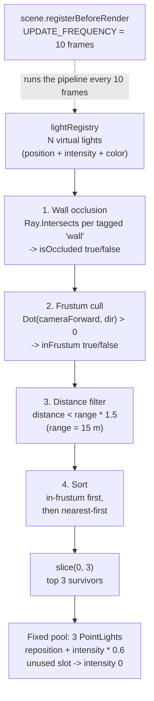

# Video Diagram 2: ClusterManager Light Pipeline

**Beat:** ~1:30  ·  **Claim:** The renderer stays under the 3-lights-per-mesh shader limit by feeding a fixed pool of 3 PointLights through a 4-stage filter, repositioned every 10 frames.

## Diagram

## Speaker Notes (beat ~1:30)

- Babylon's standard shader caps how many dynamic lights can affect a single mesh — here that limit is 3. The level wants dozens of glowing signs and lamps, so we can't just attach one Babylon light per source.
- Instead every light source is registered as a cheap *virtual* entry — just position, intensity, and color stored in a Map. No GPU light is created.
- Each update runs the registry through four filters: walls occlude lights you can't see line-of-sight to, the camera frustum culls lights behind you, the distance filter drops anything beyond 1.5× range, and a sort puts in-frustum and nearest lights first.
- The top three survivors are copied into a fixed pool of three real PointLights — intensity scaled to 60% for a softer look, and any unused pool slot is switched to intensity zero.
- The whole pipeline only runs every 10 frames via `registerBeforeRender`, so it's cheap. The net effect: N authored lights, 3 GPU lights, zero shader blowups.

## Source References

- `fx/lighting/ClusterManager.js:6-37` — `lightRegistry` (Map of virtual lights); `activeLights` pool of 3 `PointLight`s; range from config (l29, 15 m); warm-white diffuse (l30).
- `fx/lighting/ClusterManager.js:105` — `getMeshesByTags("wall")` fetches occluders.
- `fx/lighting/ClusterManager.js:117-127` — per-wall `BABYLON.Ray.Intersects` sets `isOccluded`.
- `fx/lighting/ClusterManager.js:130-133` — `Dot(cameraForward, dir) > 0` sets `inFrustum`.
- `fx/lighting/ClusterManager.js:138-141` — keep lights where `!isOccluded && distance < range * 1.5`.
- `fx/lighting/ClusterManager.js:144-151` — sort: in-frustum first, then ascending distance.
- `fx/lighting/ClusterManager.js:154` — `visibleLights.slice(0, MAX_ACTIVE_LIGHTS)` (the top 3).
- `fx/lighting/ClusterManager.js:172-174` — reposition pool light; `intensity = sourceLight.intensity * 0.6`.
- `fx/lighting/ClusterManager.js:194-196` — unused pool lights set to `intensity = 0`.
- `fx/lighting/ClusterManager.js:204-221` — `UPDATE_FREQUENCY = 10`; `scene.registerBeforeRender` frame counter.
- `config/config.js:14-22` — `MAX_LIGHTS_PER_MESH: 3`, `DEFAULT_LIGHT_RANGE: 15`.
