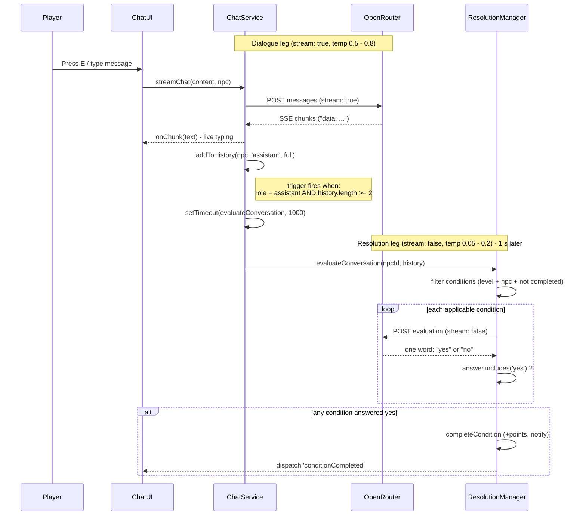

# Video Diagram 3: Dual-LLM Dialogue Round Trip

**Beat:** ~2:10  ·  **Claim:** Two LLM calls serve different purposes — a streaming creative dialogue model, and a 1-second-delayed cold yes/no evaluator that fires `conditionCompleted`.

## Diagram

## Speaker Notes (beat ~2:10)

- One conversation, two LLM calls, two very different jobs. The split exists because creativity and judgment need opposite settings.
- The **dialogue leg** streams: `stream: true`, temperature 0.5 to 0.8. The NPC's reply token-streams straight into the chat UI as it's generated, so the player sees it type live.
- The moment the assistant reply lands in history, a trigger fires — but only once there's been a real back-and-forth (at least two messages). It schedules the second call on a 1-second `setTimeout` so the UI never blocks.
- The **resolution leg** is the cold evaluator: `stream: false`, temperature 0.05 to 0.2. It sends the formatted transcript plus a condition prompt and demands exactly one word — "yes" or "no".
- `answer.includes('yes')` is the whole gate. On yes, `completeCondition` awards points, pops a notification, and dispatches `conditionCompleted` so quest state advances. Same transcript, two temperatures, two roles.

## Source References

- `quest/chatService.js:108-394` — `streamChat`: builds messages, POSTs to OpenRouter, reads SSE stream.
- `quest/chatService.js:287-289` — SSE line parsing: strips `data: ` prefix, breaks on `[DONE]`.
- `quest/chatService.js:317-327` — extracts `choices[0].delta.content`, invokes `onChunk`.
- `quest/chatService.js:55-76` — `addToHistory`: appends message, trims to `max_history_length`.
- `quest/chatService.js:69-74` — the trigger: `role === 'assistant' && history.length >= 2` → `setTimeout(..., 1000)` → `window.resolutionManager.evaluateConversation(...)`.
- `quest/ResolutionManager.js:48-81` — `evaluateConversation`: filters conditions by current level, npc id (or "ANY"), and not-yet-completed.
- `quest/ResolutionManager.js:93-181` — `checkConditionWithLLM`: non-streaming POST using `resolution` model config.
- `quest/ResolutionManager.js:158` — `answer = choices[0].message.content.trim().toLowerCase()`.
- `quest/ResolutionManager.js:175` — `return answer.includes('yes')`.
- `quest/ResolutionManager.js:183-209` — `completeCondition`: marks completed, adds points, shows notification, dispatches `conditionCompleted` (l196-202), checks level completion.
- `config/llm.js:9-100` — per-model `dialogue` block (`stream: true`, temp 0.5-0.8) vs `resolution` block (`stream: false`, temp 0.05-0.2).
