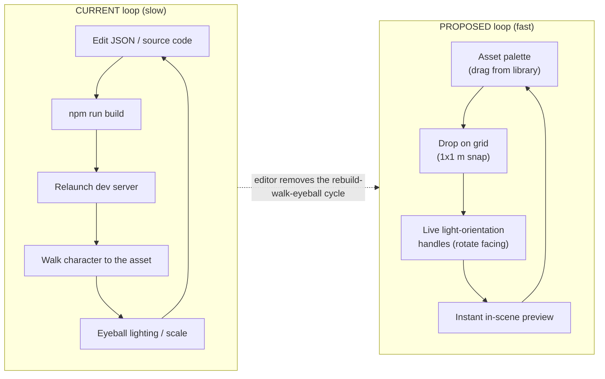

# Video Diagram 5: Proposed Level Editor

**Beat:** ~3:00  ·  **Claim (forward-looking):** A level editor with an asset palette, grid placement, and live light-orientation handles would eliminate the relaunch-to-check loop.

> **PROPOSED / ASPIRATIONAL — no code exists.** This diagram is a conceptual sketch of a future workflow, not a description of anything built. It cites no source files because there is nothing to cite. **This is the first diagram to cut if the video runs long.**

## Diagram

## Speaker Notes (beat ~3:00)

- Be explicit on camera: this is aspirational, not built. It's the "where this could go" beat, not a shipped feature.
- Today's loop is painfully serial: tweak a JSON field or a line of code, rebuild, relaunch, walk the character over to the asset, eyeball whether the lighting and scale look right, then go back and do it again. Minutes per iteration.
- The proposed editor collapses that to seconds: drag an asset from a palette, drop it onto the 1×1-meter grid, grab a light-orientation handle to spin its `facing` in-scene, and see the result instantly — no rebuild, no walk.
- The grid-snap and `facing` handle map directly onto the systems shown in Diagram 1 (the JSON sidecar) — the editor would just be writing those same fields visually instead of by hand.
- If the video is running long, cut this beat first. Everything in Diagrams 1-4 is grounded in shipped code; this one is the speculation.

## Source References

- *None — this diagram describes a proposed feature. No implementing code exists yet. The relevant shipped primitives it would build on are the JSON sidecar schema (see Diagram 1) and `BaseComponent.setWorldPosition` / `facing` rotation (`components/BaseComponent.js:125-133`, `levels/singapore6/buildings.js:323-346`).*
